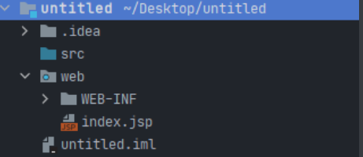
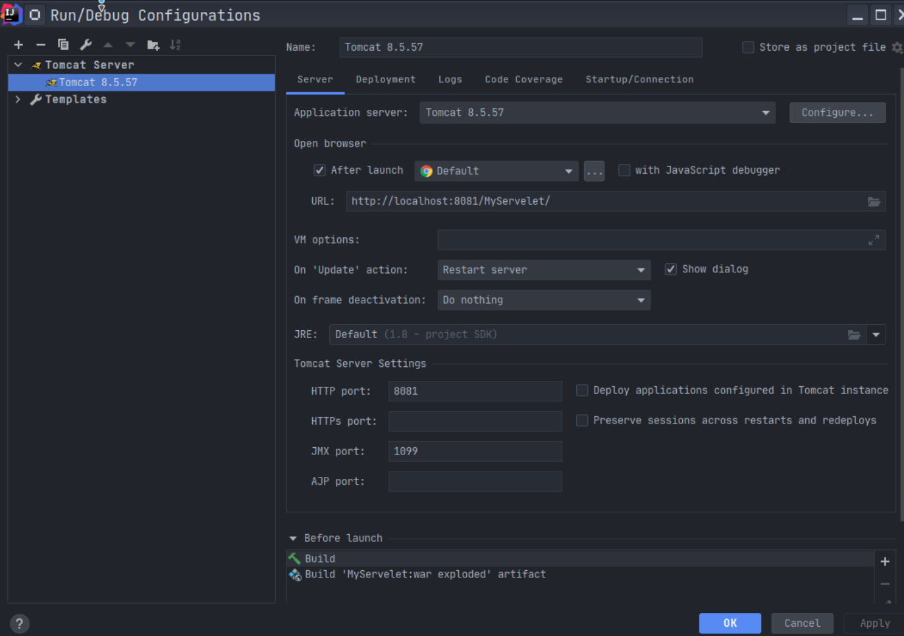
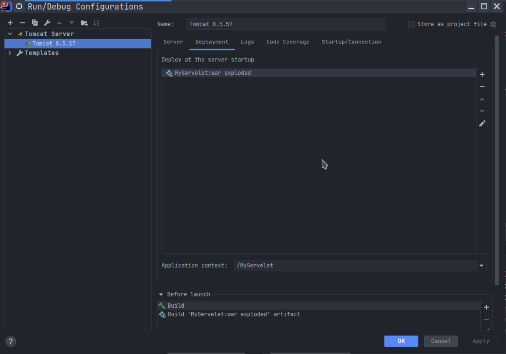
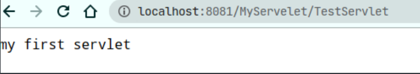

采用的是版本较新的idea2020.2, 使用的操作系统为``MANJARO LINUX``, 其中的过程挺迷迷糊糊的就水一篇来记录一下. 

```
File --> New --> Project --> Java --> Nextnext 新建一个项目
```

```
右键Project --> open module setting --> 点击+号 --> 导入tomcat8的Servlet-api.jar 
```


```
右键项目 --> Add Frameworks Support --> 选中web application
```


选中后会多出来几个东西, 如下图, 多了``WEB-INF``目录和``index.jsp``



``Web-INF``里面有只有一个``web.xml``, 什么是``WEB-INF``? 根据百度百科的介绍

> WEB-INF是Java的WEB应用的安全目录。所谓安全就是客户端无法访问，只有服务端可以访问的目录。如果想在页面中直接访问其中的文件，必须通过web.xml文件对要访问的文件进行相应映射才能访问。
>
> WEB-INF文件夹下除了web.xml外，还存一个classes文件夹，用以放置 *.class文件，这些 *.class文件是网站设计人员编写的类库，实现了jsp页面前台美工与后台服务的分离，使得网站的维护非常方便。web.xml文件为网站部署描述XML文件，对网站的部署非常重要。
>
> Web-Inf文件夹中除了有classes文件夹和一个web.xml文件外、还有lib文件夹（用于存放需要的jar包）（用于配置，比如说用来配置过滤器等。）
>
> /WEB-INF/src/
> 　　源码目录，按照包名结构放置各个java文件。
>
> /WEB-INF/database.properties
> 　　数据库配置文件
>
> /WEB-INF/tags/
>
> 存放了自定义标签文件，该目录并不一定为 tags，可以根据自己的喜好和习惯为自己的标签文件库命名，当使用自定义的标签文件库名称时，在使用标签文件时就必须声明正确的标签文件库路径。例如：当自定义标签文件库名称为 simpleTags 时，在使用 simpleTags 目录下的标签文件时，就必须在 jsp 文件头声明为：<%@ taglibprefix="tags" tagdir="/WEB-INF /simpleTags" % >。
>
> /WEB-INF/jsp/
>
> jsp 1.2 以下版本的文件存放位置。改目录没有特定的声明，同样，可以根据自己的喜好与习惯来命名。此目录主要存放的是 jsp 1.2 以下版本的文件，为区分 jsp 2.0 文件，通常使用 jsp 命名，当然你也可以命名为 jspOldEdition 。
>
> /WEB-INF/jsp2/
>
> 与 jsp 文件目录相比，该目录下主要存放 Jsp 2.0 以下版本的文件，当然，它也是可以任意命名的，同样为区别 Jsp 1.2以下版本的文件目录，通常才命名为 jsp2。
>
> META-INF
>
> 相当于一个信息包，目录中的文件和目录获得Java 2平台的认可与解释，用来配置应用程序、扩展程序、类加载器和服务
> 　　manifest.mf文件，在用jar打包时自动生成。

最重要的是``classes``文件夹和``lib``文件夹, 所以新建两个文件夹, 一个是``classes``,  另一个是``lib``, 配置项目结构让编译出来的class文件输出到``classes``中去


然后在``src``目录下面编写``TestServlet.java``文件

```java
import javax.servlet.ServletException;
import javax.servlet.annotation.WebServlet;
import javax.servlet.http.HttpServlet;
import javax.servlet.http.HttpServletRequest;
import javax.servlet.http.HttpServletResponse;
import java.io.IOException;

@WebServlet("/TestServlet")
public class TestServelet extends HttpServlet {
    @Override
    protected void doGet(HttpServletRequest req, HttpServletResponse resp) throws IOException, ServletException {
        resp.getWriter().write("my first servlet");
    }
}

```

然后添加运行配置, 在``Manjaro linux``里面``tomcat``的目录是``/usr/share/tomcat8/``, ps: 为了不和``burpsuite``的默认端口冲突, 我将``tomcat``服务的默认端口设置在了8081.



如果有提示错误的化就点击fix去修复, 然后在``Development``下面修改context, 这样就可以通过``http://localhost:8081/MyServlet``访问到服务了.



点击运行就可以启动``Tomcat``服务器了.



