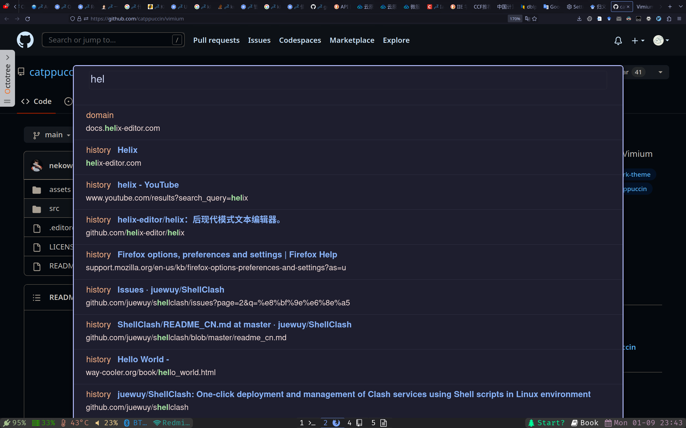

不管火狐的市场份额多么拉胯, 对于Linux wayland用户来说, 目前体验最好的浏览器依旧是Firefox. 本篇记录我的FIrefox配置, 包括浏览器设置和插件设置.

## 外观

### titlebar

为了让标题栏中的内容可以更加紧凑, 一个好办法是进入`about:config`, 设置`browser.compactmode.show`为true, 然后进入custom toolbar, 设置`Density`为`Compact`


对于wm用户, 一个推荐的设置是勾选上上图中的`Title Bar`选项, 为什么要这么设置呢, 因为这样子做, 那些按钮(最大最小化, 关闭窗口)就会出现到title bar中, 然后title bar会被wm吃掉, 这样就可以给火狐的标题栏留出更多的空间

ps: 我用的主题名字叫做tokyonight

### Firefox-UI-Fix

使用[Firefox-UI-Fix](https://github.com/black7375/Firefox-UI-Fix)来个性化Firefox的界面

## Addon

### Vimium

该插件将vim的操作方式带入到浏览器中, 能够让用户更少依赖鼠标.

默认情况下, firefox出于安全考虑会在一些页面中禁用Addon, 为了让该插件能够在更多的页面上使用, 需要在`about:config`中进行以下设置

1. `extensions.webextensions.restrictedDomains`清空掉
2. `privacy.resistFingerprinting.block_mozAddonManager`设置为true,来让插件在所有页面上都可以使用

以下是我的Vimium键位设置.

```
# Insert your preferred key mappings here.
unmapAll
map H previousTab
map J previousTab
map L nextTab
map K nextTab
map <c-j> scrollPageDown
map <c-k> scrollPageUp
map <c-o> goBack
map <c-i> goForward
map o Vomnibar.activateInNewTab
map b Vomnibar.activateBookmarksInNewTab
map t Vomnibar.activateTabSelection
map M LinkHints.activateModeToOpenInNewTab
map m LinkHints.activateModeToOpenInNewForegroundTab
map gi focusInput
map gg scrollToTop
map G scrollToBottom
map j scrollDown
map k scrollUp
map h scrollLeft
map l scrollRight
map x removeTab
map X restoreTab
map ? showHelp
map yy copyCurrentUrl
map p openCopiedUrlInNewTab
```

Tip: 如果在某次更新之后发现插件不可用了, 那么可以考虑临时切换到另一个类似的插件 Vimium C , 把相同的键位复制进去就行啦.

然后, 虽然我不经常用, 但是vomnibar是个好东西, 按一个键即可呼出, 在其中搜索tab, 书签, 历史记录, 以及调用搜索引擎,可惜默认主题有点丑, 可以去github上找一些主题, 我个人用的是 https://github.com/catppuccin/vimium



### Tampermonkey

常用的脚本不多, 有 https://github.com/the1812/Bilibili-Evolved 和https://github.com/wandou-cc/blog-ui

### Checker Plus for Gmail

进入`Option`, 添加账号并且设置为`stay signed in`, 就可以方便管理多个gmail邮箱了.

### 其他

- Zotero Connector : 搜集文献的时候用的
- Cookie-Editor : 编辑Cookie
- Dark Reader : 全部页面化为暗色模式
- Google Scholar Button : 谷歌学术查询, 可以方便查文献
- Octotree : 在github仓库网页上列出文件树, 方便临时查阅代码
- TWP : 谷歌翻译插件
- uBlock Origin : 因为效果太好被chrome下架了一阵子的广告拦截插件
- Adblocker for youtube: 跳过youtube的广告

## 视频硬件解码

参考[Archwiki](https://wiki.archlinuxcn.org/wiki/%E7%81%AB%E7%8B%90#%E8%A7%86%E9%A2%91%E7%A1%AC%E8%A7%A3)

```
gfx.webrender.all = true
gfx.webrender.enabled = true
media.ffmpeg.vaapi.enabled = true
media.ffvpx.enabled = false
media.navigator.mediadatadecoder_vpx_enabled = true
media.rdd-vpx.enabled = false
```
由于vainfo显示我的显卡不支持av1解码,所以禁用av1比较好
```
media.av1.enabled = false
```
至于vdpau, 由于只有nvidia才可以用, 我没有n卡, 所以不需要安装.

最后可以使用`nvtop`来查看视频硬解是否正常工作, 如果出现`DEC`字样说明正常.

## 最后

我并不是一个Mozilla吹, 恰恰相反, 我对这个把大把金钱花在政治活动和给管理层发工资的组织颇有微词, 如果你有兴趣, 可以看看[相关的调查报告](https://lunduke.locals.com/post/4387539/firefox-money-investigating-the-bizarre-finances-of-mozilla).

只是相比之下, 利用自己的市场占有率强行推Manifest v3 和 Web Environment Integrity API 的 google很明显希望对浏览器插件进行最大程度的限制, 尤其是影响到他们赚钱的广告拦截器. 这样的行为很明显与互联网的自由开放精神相互违背, 但是很遗憾, 抛弃chrome选择其他chromium-based浏览器并不能解决问题, 用户依旧受制于chromium的代码库, 而后者作为这些浏览器的基础代码, 只要谷歌对其进行修改, 那么其他浏览器迟早都要跟进. 即便是Firefox也使用了Manifest V3, 但是他依旧保留了Manifest V2, 算是一点小小的反抗吧. 
