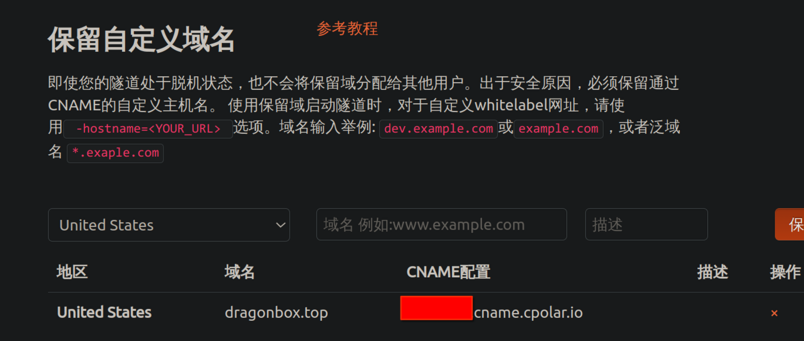
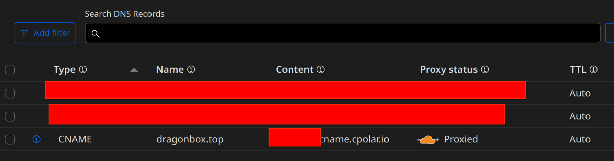
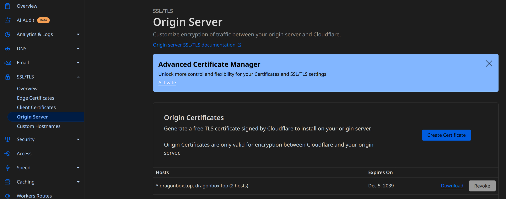

# 记录一次域名购买并使用在隧道服务的经历 

## Godaddy 域名购买

其实Godaddy的域名还是偏贵的... 但一年50块钱的top域名还算可以接受就是了, 而且不用像在国内购买域名一样要实名制, 而且支持支付宝, 挺ok的.

## Cloudflare 域名托管

在购买域名完成之后, 我发现Godaddy是不允许为主域名设置CNAME的, 这就有点不能接受, 然而师弟告诉我Cloudflare可以, 遂用其托管.

点击添加域名, 填入在Godaddy购买的域名

点击Continue, 等到Cloudflare发现Godaddy下的dns记录, 继续, 看到套餐页面选择免费的套餐就可以了, 之后选择复制Cloudflare给出的ns记录.

来到Godaddy的控制台, 在DNS -> Nameservers 下面选择改变nameservers, 将Cloudflare给出的ns记录复制进去, 保存后等待Cloudflare页面将域名的状态更新为Active, 这样托管就完成了.

## Cpolar使用自定义域名

接下来就是将域名解析到Cpolar提供的隧道中了, 进入Cpolar的控制面板, 点击自定义域名, 创建一个cname记录.

然后在Cloudflare的DNS面板中为主域名添加这条CNAME, 这样就可以把主域名解析到cpolar提供的隧道中了.

## TLS/SSL 证书

在Cloudflare的Origin Server中, 点击创建证书, 不得不感叹Cloudflare的良心, 在国内云厂商纷纷对SSL证书收费的情况下, Cloudflare能够提供15年有效期的免费证书, 真的友好.

申请完毕之后将证书和密钥下载下来, 进入本地的Cpolar服务面板, 新建隧道并上传证书后启动即可, 如图所示.

PS: 另外, 在高级选项中, 似乎HTTP绑定方式必须为同时启动, 并且重定向到HTTPS这一项需要设置为false, 否则会出现404的情况, 不知道为什么.
