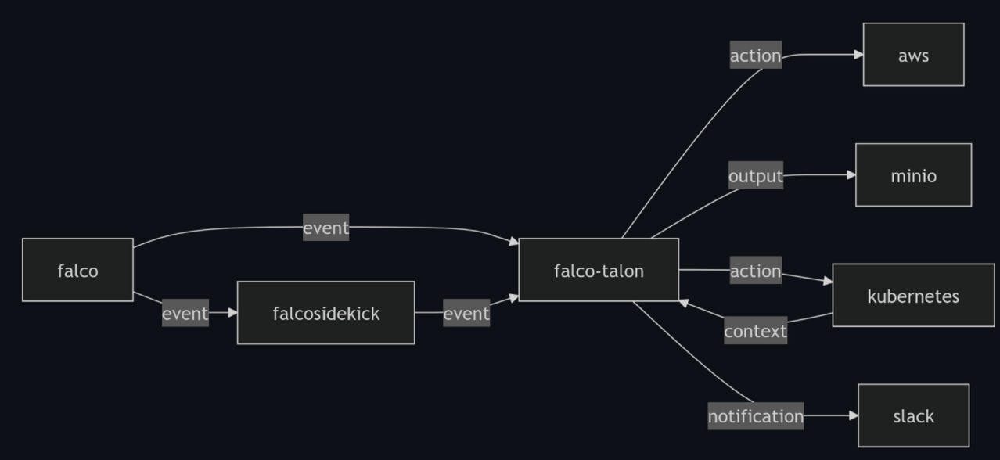
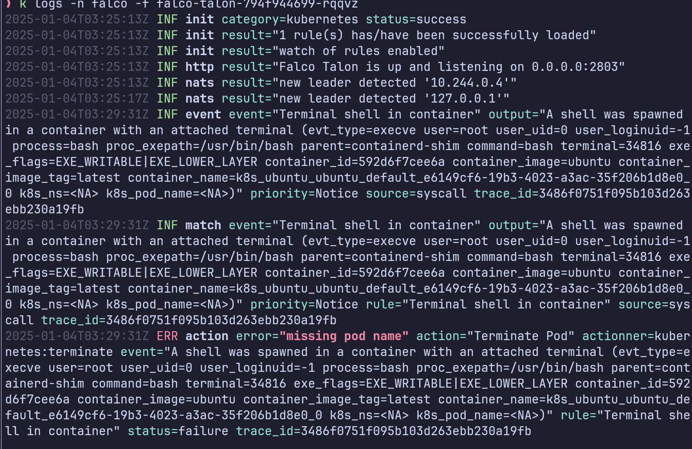

# Falco Talon

## 介绍

Falco Talon是一个新诞生没多久的项目, 其目的是在falco发现威胁之后提供一个统一的威胁响应框架, 而无需用户自己写代码去解析Falco的日志输出并处理威胁, 可以说falco talon的出现打通了威胁发现到威胁响应的环节. 根据官网的描述, falco talon 的工作流程如下:



1. falco通过规则匹配发现危险行为
2. 发现危险行为的事件通过falcosidekick或者直接发送给falco-talon
3. falco-talon根据自身另外一套规则来对事件进行匹配, 根据匹配的结果来执行特定的响应行为
4. 将输出和通知发送给其他组件

举一个例子: falco发现了容器A存在搜索敏感凭证的行为, 将事件通过falcosidekick发布给集群中的falco-talon, 后者将告警和自身规则匹配后发现应该执行容器销毁操作, 于是执行行为, 容器A被销毁.

对于使用者来说, falco-talon中有几个重要的概念需要知悉, 分别是Actionners和Notifiers

### Actionners

Actionners就是行为响应组件, 以一个规则为例:

```yaml
- action: Get logs of the pod
  actionner: kubernetes:download
  parameters:
    tail_lines: 200
  output:
    target: local:file
    parameters:
      destination: /var/logs/falco-talon/
```

上述规则中, actionner是kubernetes:download, 即kubernetes平台下具备文件下载能力的行为响应组件, 而其输出将会存储为/var/logs/falco-talon/下的本地文件 .

目前, falco-talon支持以下平台的多种Actionners:

- kubernetes
  - kubernetes:terminate
  - kubernetes:label
  - kubernetes:annotation
  - kubernetes:networkpolicy
  - kubernetes:exec
  - kubernetes:script
  - kubernetes:log
  - kubernetes:download
  - kubernetes:tcpdump
  - kubernetes:delete
  - kubernetes:cordon
  - kubernetes:drain
- calico
  - calico:networkpolicy
- cilium
  - cilium:networkpolicy
- aws
  - aws:lambda
- gcp
  - gcp:function

此外, 也支持将actionner下载或者创建的内容存储到以下类型的空间中:

- local:file
- aws:s3
- gcp:gcs
- minio:s3

### Notifiers

falco-talon可以将actionner执行后的结果通过Notifiers发布, 目前支持以下几种发布方式:

- k8sevents
- slack
- loki
- Elasticsearch
- smtp
- webhook

## 环境搭建

首先, 建立一个k8s集群, 由于需要安装falco, driver应该选择virtualbox或者kvm2.

```sh
minikube start --driver=kvm2
```

接下来安装falco-talon, 首先克隆[charts仓库](https://github.com/falcosecurity/charts),修改falco-talon目录下的values.yaml.

```yaml
rulesOverride: |
  - action: Terminate Pod
    actionner: kubernetes:terminate
    parameters:
      grace_period_seconds: 5
      ignore_standalone_pods: true

  - rule: Terminal shell in container
    match:
      rules:
        - Terminal shell in container
      output_fields:
        - k8s.ns.name!=kube-system, k8s.ns.name!=falco
    actions:
      - action: Terminate Pod
```

上述规则规则的用处是在接收到Terminal shell in container事件的时候将目标pod删除, 因为falco默认规则中就有Terminal shell in container这样一条规则, 因此无需对falco的规则进行修改.

接下来通过helm部署:

```sh
helm repo add falcosecurity https://falcosecurity.github.io/charts
helm repo update falcosecurity
helm upgrade --install falco-talon falcosecurity/falco-talon --namespace falco --create-namespace -f values.yaml
helm install falco falcosecurity/falco --namespace falco \
  --create-namespace \
  --set tty=true \
  --set falcosidekick.enabled=true \
  --set falcosidekick.config.talon.address=http://falco-talon:2803
```

## 使用

创建一个测试pod

```yaml
apiVersion: v1
kind: Pod
metadata:
  name: ubuntu
spec:
  containers:
    - name: ubuntu
      image: ubuntu:latest
      command: ["/bin/bash", "-c"]
      args: ["sleep 365d"]
      imagePullPolicy: IfNotPresent
```

使用kubectl创建shell连接

```sh
kubectl exec -it ubuntu -- /bin/bash
```

就会发现actionner被执行了, 但是我在测试的时候发现falco存在bug, 传来的信息存在缺失, 导致falco talon执行actionner失败了.



## 源码阅读

直接看`cmd/server.go`中`Run`下面的函数.

加载配置和规则, `RarseRules`的部分挺多的, 有需求的可以细看:

```go
configFile, _ := cmd.Flags().GetString("config")
config := configuration.CreateConfiguration(configFile)
utils.SetLogFormat(config.LogFormat)
rulesFiles, _ := cmd.Flags().GetStringArray("rules")
if len(rulesFiles) != 0 {
  config.RulesFiles = rulesFiles
}
rules := ruleengine.ParseRules(config.RulesFiles)
```

接下来获取内置的Actionners和Outputs, 用于对规则进行验证

```go
defaultActionners := actionners.ListDefaultActionners()
defaultOutputs := outputs.ListDefaultOutputs()
```

`ListDefaultActionners`会返回内部支持的Actionners, Outputs也是类似:

```go
func ListDefaultActionners() *Actionners {
	if len(*defaultActionners) == 0 {
		defaultActionners.Add(
			k8sTerminate.Register(),
			k8sLabel.Register(),
			k8sAnnotation.Register(),
			k8sNetworkpolicy.Register(),
			k8sExec.Register(),
			k8sScript.Register(),
			k8sLog.Register(),
			k8sDelete.Register(),
			k8sCordon.Register(),
			k8sDrain.Register(),
			k8sDownload.Register(),
			k8sTcpdump.Register(),
			lambdaInvoke.Register(),
			gcpFunctionCall.Register(),
			calicoNetworkpolicy.Register(),
			ciliumNetworkpolicy.Register(),
		)
	}

	return defaultActionners
}
```

挑其中的`k8sTerminate`看看, 代码位置在`actionners/kubernetes/terminal/terminal.go`中.

```go
type Actionner struct{}

func Register() *Actionner {
	return new(Actionner)
}
```

好嘟, 看起来这些都是Actionner结构体实例.

接下来在for循环中对每一条规则的有效性进行验证.

```go
actionner := defaultActionners.FindActionner(j.GetActionner())
if actionner == nil {
  utils.PrintLog("error", utils.LogLine{Error: "unknown actionner", Rule: i.GetName(), Action: j.GetName(), Actionner: j.GetActionner(), Message: "rules"})
  valid = false
} else {
  if err := actionner.CheckParameters(j); err != nil {
    utils.PrintLog("error", utils.LogLine{Error: err.Error(), Rule: i.GetName(), Action: j.GetName(), Actionner: j.GetActionner(), Message: "rules"})
    valid = false
  }
}
if actionner != nil {
  o := j.GetOutput()
  if o == nil && actionner.Information().RequireOutput {
    utils.PrintLog("error", utils.LogLine{Error: "an output is required", Rule: i.GetName(), Action: j.GetName(), Actionner: j.GetActionner(), Message: "rules"})
    valid = false
  }
  if o != nil {
    output := defaultOutputs.FindOutput(o.GetTarget())
    if output == nil {
      utils.PrintLog("error", utils.LogLine{Error: "unknown target", Rule: i.GetName(), Action: j.GetName(), OutputTarget: o.GetTarget(), Message: "rules"})
      valid = false
    } else if len(o.Parameters) == 0 {
      utils.PrintLog("error", utils.LogLine{Error: "missing parameters for the output", Rule: i.GetName(), Action: j.GetName(), OutputTarget: o.GetTarget(), Message: "rules"})
      valid = false
    } else {
      if err := output.CheckParameters(o); err != nil {
        utils.PrintLog("error", utils.LogLine{Error: err.Error(), Rule: i.GetName(), Action: j.GetName(), OutputTarget: o.GetTarget(), Message: "rules"})
        valid = false
      }
    }
  }
}
```

1. 获取action部分, 检查actionner是否存在以及是否存在于内置actionners中
2. 检查参数是否合法, 因为不同的actionners可能需要参数
3. 获取output部分, 并检查其output的目标是否存在于内置outputs中
4. 检查output中的参数类型是否合法

验证通过后开始初始化actionners和outputs, 点开`actionners.Init`看看:

```go
func Init() error {
	rules := rules.GetRules()

	categories := map[string]bool{}
	enabledCategories := map[string]bool{}

	// 只要有一个rule, 就会输出化该rule对应类别的actionner
	// list actionner categories to init
	for _, i := range *rules {
		for _, j := range i.Actions {
			categories[j.GetActionnerCategory()] = true
		}
	}

	for category := range categories {
		for _, actionner := range *defaultActionners {
			if category == actionner.Information().Category {
				if err := actionner.Init(); err != nil {
					utils.PrintLog("error", utils.LogLine{Message: "init", Error: err.Error(), Category: actionner.Information().Category, Status: utils.FailureStr})
					return err
				}
				enabledCategories[category] = true
			}
		}
	}

	for i := range enabledCategories {
		for _, j := range *defaultActionners {
			if i == j.Information().Category {
				enabledActionners.Add(j)
			}
		}
	}

	return nil
}
```

获取了所有规则, 然后根据规则的类别分别初始化actionner, 最后添加到enabledActionners全局变量中, 那么以kubernetes:delete为例子看看.

```go
func (a Actionner) Init() error {
	return k8s.Init()
}
```

`Init`中对k8s的client进行了初始化, 这里就不贴了.

然后是对outputs的初始化和notifier的初始化, 和actionner的初始化代码是类似的.

接下来创建了一个httpserver

```go
srv := http.Server{
  Addr:         fmt.Sprintf("%s:%d", config.ListenAddress, config.ListenPort),
  ReadTimeout:  2 * time.Second,
  WriteTimeout: 2 * time.Second,
  Handler:      newHTTPHandler(),
}
```

这是要做什么? 其实这就是falco talon用于接收来自falcosidekick事件信号用的, 点进去这个`newHTTPHandler`看一看

```go
func newHTTPHandler() http.Handler {
	mux := http.NewServeMux()
	mux.Handle("/metrics", metrics.Handler())

	handleFunc := func(pattern string, handlerFunc func(http.ResponseWriter, *http.Request)) {
		otelHandler := otelhttp.WithRouteTag(pattern, http.HandlerFunc(handlerFunc))
		mux.Handle(pattern, otelHandler)
	}

	handleFunc("/", handler.MainHandler)
	handleFunc("/healthz", handler.HealthHandler)

	otelHandler := otelhttp.NewHandler(
		mux,
		"/",
		otelhttp.WithFilter(func(req *http.Request) bool {
			return req.URL.Path == "/"
		}))
	return otelHandler
}
```

跟进`MainHandler`:

```go
func MainHandler(w http.ResponseWriter, r *http.Request) {
  // ...
	event, err := events.DecodeEvent(r.Body)
  // ...

	tracer := traces.GetTracer()
	ctx, span := tracer.Start(rctx, "event",
		trace.WithAttributes(attribute.String("event.rule", event.Rule)),
		trace.WithAttributes(attribute.String("event.source", event.Source)),
		trace.WithAttributes(attribute.String("event.priority", event.Priority)),
		trace.WithAttributes(attribute.String("event.output", event.Output)),
		trace.WithAttributes(attribute.String("event.tags", strings.ReplaceAll(strings.Trim(fmt.Sprint(event.Tags), "[]"), " ", ", "))),
		trace.WithAttributes(attribute.StringSlice("event.tags", tags)),
	)
  // ...

	hasher := md5.New() //nolint:gosec
	hasher.Write([]byte(event.Output))

    // NOTE: Publish the event to NATS
	err = nats.GetPublisher().PublishMsg(ctx, hex.EncodeToString(hasher.Sum(nil)), event.String())
	if err != nil {
		http.Error(w, "Internal Server Error", http.StatusInternalServerError)
	}
}
```

这个函数里面用到了两个没见过的库, 一个是`otel/trace`, 是 OpenTelemetry 库的一部分, 它用于支持应用程序的分布式追踪功能.

另一个是`nats-io/nats.go`, 这个就有意思了, 它用于集成NATS消息系统, 什么是NATS消息系统? 根据官网的解释:

> NATS 是一种允许以消息形式进行数据交换的基础设施。我们称之为“面向消息的中间件”。

而代码中的`nats.GetPublisher.PublishMsg`就是将事件消息推送出去, 给其他客户端消费, 而在`server.go`中`nats.GetConsumer().ConsumeMsg()`就启动了一个消费者, 因此这边的nats的作用是在多个falco-talon实例之间传递消息.

回到 `server.go`, 对于设置了`watch_rules`的情况, 程序启动了一个goroutine来监听和更新规则, 其中的内容和初始化是差不多的.

下面, 在启动了nats server之后, 如果设置了LeaderElection:

```go
if config.Deduplication.LeaderElection {
  go func() {
    err2 := k8s.Init()
    if err2 != nil {
      utils.PrintLog("fatal", utils.LogLine{Error: err2.Error(), Message: "lease"})
    }
    c, err2 := k8s.GetClient().GetLeaseHolder()
    if err2 != nil {
      utils.PrintLog("fatal", utils.LogLine{Error: err2.Error(), Message: "lease"})
    }
    for {
      s := <-c
      if s == *utils.GetLocalIP() {
        s = "127.0.0.1"
      }
      utils.PrintLog("info", utils.LogLine{Result: fmt.Sprintf("new leader detected '%v'", s), Message: "nats"})
      err2 = nats.GetPublisher().SetJetStreamContext("nats://" + s + ":4222")
      if err2 != nil {
        utils.PrintLog("error", utils.LogLine{Error: err2.Error(), Message: "nats"})
      }
    }
  }()
}
```

由`Deduplication.LeaderElection`这个选项不难猜测, 上面的代码是为了处理多实例备份的情况, 主要做了这样的事情:

- 通过`k8s.GetClient().GetLeaseHolder()`获取k8s中的租约, 有关租约可以看[文档](https://kubernetes.io/zh-cn/docs/concepts/architecture/leases/)
- 通过租约确定领导者, 进而确定nats的发布渠道

之后也是最关键的一步, 获取消费者chan, 并提供给actionners进行消费, actionners会从chan接收事件并根据规则进行威胁响应.

```go
c, err := nats.GetConsumer().ConsumeMsg()

if err != nil {
  utils.PrintLog("fatal", utils.LogLine{Error: err.Error(), Message: "nats"})
}
go actionners.StartConsumer(c)
```

所以来看看StartConsumer函数.

```go
func StartConsumer(eventsC <-chan nats.MessageWithContext) {
	config := configuration.GetConfiguration()
	for {
    // ...
		for _, i := range triggeredRules {
      // ...
			for _, a := range i.GetActions() {
        // ...
				err := runAction(mctx, i, a, e)
				if err != nil && a.IgnoreErrors != trueStr {
					break
				}

			}

			if i.Continue == falseStr {
				break
			}
		}
	}
}

```

这里遍历了触发的规则和对应的action, 分别执行, 进入runAction可以看到

```go
func runAction(mctx context.Context, rule *rules.Rule, action *rules.Action, event *events.Event) (err error) {
  // ...
	result, data, err := actionner.Run(event, action)
  // ...
	output := action.GetOutput()
  // ...
	go notifiers.Notify(actx, rule, action, event, log)
  // ...
	if actionner.Information().AllowOutput && output != nil && data != nil {
    // ...
		target := output.GetTarget()
		o := outputs.GetOutputs().FindOutput(target)
    // ...
		result, err = o.Run(output, data)
    // ...
		go notifiers.Notify(octx, rule, action, event, logO)
    // ...
	}

	return nil
}
```

抛开配置项中的代码不谈, 这里做的事情是执行actionner并获取输出, 之后通过`o.Run`来将输出存储到合适的位置(可以选择的有`file` `aws` `gcs` 和 `minio`), 最后将结果以Notify函数发送出去(可选的notifier有 `elasticsearch` `http` `k8sevents` `loki` `slack` `smtp` 和 `webhook`).

以file这个output为例子, 其将输出存储到本地文件中:

```go
func (o Output) Run(output *rules.Output, data *models.Data) (utils.LogLine, error) {
  // ...
	var key string
	switch {
	case data.Objects["namespace"] != "" && data.Objects["pod"] != "":
		key = fmt.Sprintf("%v_%v_%v_%v", time.Now().Format("2006-01-02T15-04-05Z"), data.Objects["namespace"], data.Objects["pod"], strings.ReplaceAll(data.Name, "/", "_"))
	case data.Objects["hostname"] != "":
		key = fmt.Sprintf("%v_%v_%v", time.Now().Format("2006-01-02T15-04-05Z"), data.Objects["hostname"], strings.ReplaceAll(data.Name, "/", "_"))
	default:
		var s string
		for i, j := range data.Objects {
			if i != "file" {
				s += j + "_"
			}
		}
		key = fmt.Sprintf("%v_%v%v", time.Now().Format("2006-01-02T15-04-05Z"), s, strings.ReplaceAll(data.Name, "/", "_"))
	}

	dstfile := fmt.Sprintf("%v/%v", strings.TrimSuffix(parameters.Destination, "/"), key)

	objects := map[string]string{
		"file":        data.Name,
		"destination": dstfile,
	}

	if err := os.WriteFile(dstfile, data.Bytes, 0600); err != nil {
		return utils.LogLine{
			Objects: objects,
			Error:   err.Error(),
			Status:  utils.FailureStr,
		}, err
	}
  // ...
}
```

`server.go`最后将会启动srv, 通过上面代码分析可知srv就是一个负责转发消息事件的东西,因此, 当一个实例上的falco-talon接收到事件的时候, 事件会被转发传播到集群内的其他所有falco-talon实例中.

至此对falco-talon代码的粗浅阅读完毕.
