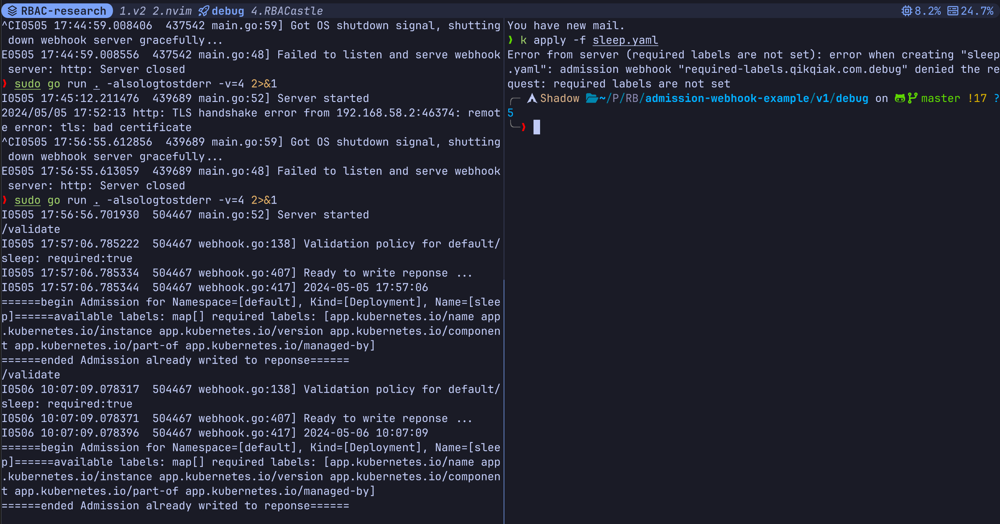

# Deployment and Debugging of Admission Webhook in Kubernetes cluster

## Intro

[Dynamic admission control](uhttps://kubernetes.io/docs/reference/access-authn-authz/extensible-admission-controllersrl) 允许开发者添加自己的逻辑代码来对提交给API Server的对象进行修改和验证, 是非常强大的功能. 本文将部署一组demo admission webhook, 包括一个validating webhook 和一个 mutating webhook, 并介绍webhook的调试方法. 本文主要使用和参考了[从0到1开发K8S_Webhook最佳实践](https://zhuanlan.zhihu.com/p/404764407), 并通过查阅官方文档对其中的一些不适应新版本k8s的内容进行了修正.

本文使用的集群环境为Kubernetes v1.25.16, 使用minikube创建. 我所在的机器为Arch Linux. 代码仓库为 [admission-webhook-example](https://github.com/scriptwang/admission-webhook-example)中的v1部分.

在开始之前, 请确保集群的API Server开启了MutatingAdmissionWebhook和ValidatingAdmissionWebhook (一般默认情况下都开启了).


## Deployment


### 创建 service account

创建一个用于webhook的service account

```sh
kubectl apply -f deployment/rbac.yaml
```


### 创建证书

API Server调用Webhook的过程是需要HTTPS通信的(其实集群内的通信几乎都是HTTPS), 因此需要为webhook创建证书来对webhook的service进行域名认证. **原博客使用的webhook-create-signed-cert.sh已经过时, 不再适用于1.25.16版本的集群了**, 主要出问题的地方如下:

```sh
# create  server cert/key CSR and  send to k8s API
cat <<EOF | kubectl create -f -
apiVersion: certificates.k8s.io/v1beta1
kind: CertificateSigningRequest
metadata:
  name: ${csrName}
spec:
  groups:
  - system:authenticated
  request: $(cat ${tmpdir}/server.csr | base64 | tr -d '\n')
  usages:
  - digital signature
  - key encipherment
  - server auth
EOF
```

根据文档, 在1.22以及之后版本的kubernetes中, `certificates.k8s.io/v1beta1` 已经被抛弃不可用, 需要修改为`certificates.k8s.io/v1`, 并且需要在`spec`中增加`signerName`, signer的作用是签署证书. k8s内置的`signerName` 有以下几种:

- `kubernetes.io/kube-apiserver-client`: 签名的证书将被 API 服务器视为客户证书. 许可的密钥用途不能包含 `["digital signature", "key encipherment", "client auth"]` 之外的键.
- `kubernetes.io/kube-apiserver-client-kubelet`: 签名的证书将被 kube-apiserver 视为客户证书. 许可的密钥用途为`["key encipherment", "digital signature", "client auth"]` 或 `["digital signature", "client auth"]`
- `kubernetes.io/kubelet-serving`: 签名服务证书，该服务证书被 API 服务器视为有效的 kubelet 服务证书. 许可的密钥用途为`["key encipherment", "digital signature", "server auth"]` 或 `["digital signature", "server auth"]`
- `kubernetes.io/legacy-unknown`: 不保证信任.

通过原来的证书签名请求的用途可以推断, 我们应该选择`kubernetes.io/kubelet-serving`作为signer, 而admission webhook在部署后也确实会作为一种服务被API Server调用, 因此在这个调用的过程中, API Server是客户端, 而webhook是服务端, 需要一个服务证书.

因此经过修改, `webhook-create-signed-cert.sh`脚本中相应部分应该更改为如下内容:


```sh
# create  server cert/key CSR and  send to k8s API
cat <<EOF | kubectl create -f -
apiVersion: certificates.k8s.io/v1
kind: CertificateSigningRequest
metadata:
  name: ${csrName}
spec:
  signerName: kubernetes.io/kubelet-serving
  groups:
  - system:authenticated
  request: $(cat ${tmpdir}/server.csr | base64 | tr -d '\n')
  usages:
  - digital signature
  - key encipherment
  - server auth
EOF
```

但是这还没完, 在执行脚本后, 我们会发现证书请求虽然通过了, 但是证书并没有签发, 原因可以通过以下命令去查阅:

```sh
kubectl get csr <csr-name> -o yaml
```

在输出中的status可以发现错误原因, 经过查阅, 可以从[官方文档](https://kubernetes.io/zh-cn/docs/reference/access-authn-authz/certificate-signing-requests/#kubernetes-signers)和[相关的github issue](https://github.com/kubernetes/kubernetes/issues/99504)中发现是csr创建时候填的内容有问题, 脚本在创建csr的时候使用的命令是:

```sh
openssl genrsa -out ${tmpdir}/server-key.pem 2048
openssl req -new -key ${tmpdir}/server-key.pem -subj "/CN=${service}.${namespace}.svc" -out ${tmpdir}/server.csr -config ${tmpdir}/csr.conf
```

但是文档中提到, `kubernetes.io/kubelet-serving`签名者规定, 许可的主体组织名必须是 `["system:nodes"]`, 用户名必须以 `system:node:` 开头, 那么经过略微修改, 正确的命令如下:

```sh
openssl genrsa -out ${tmpdir}/server-key.pem 2048
openssl req -new -key ${tmpdir}/server-key.pem -subj "/CN=system:node:${service}.${namespace}.svc/O=system:nodes" -out ${tmpdir}/server.csr -config ${tmpdir}/csr.conf
```

(这个CN的名字我不知道这么改行不行, 反正不影响后续的操作...)

重新执行脚本就可以了, 可以通过`kubectl get csr <csr-name>` 看到证书已经Issue了.

### 创建Service

有了证书自然要有相应的域名和服务, 在集群内部, 这样的服务就通过Service资源来创建. 然后部署相应的Deployment

```sh
kubectl apply -f deployment/service.yaml
kubectl apply -f deployment/deployment.yaml
```

这个Deployment中包含了ValidatingAdmissionWebhook和MutatingAdmissionWebhook的代码, 他们通过不同的路由得到触发.

```go
// main.go
mux := http.NewServeMux()
mux.HandleFunc("/mutate", whsvr.serve)
mux.HandleFunc("/validate", whsvr.serve)
whsvr.server.Handler = mux
```

### 注册ValidatingAdmissionWebhook

执行`webhook-patch-ca-bundle.sh`来对`validatingwebhook.yaml`进行patch, 替换其中的`${CA_BUNDLE}`变量, 观察这个模板文件, 可以发现他注册的是 `admission-webhook-example-svc` 的 `/validate` 路由, 并专门在deployments和services资源的创建的时候对创建行为进行验证, 此外, `matchLabels` 部分规定了只有namespace有`admission-webhook-example: enabled` 这样的label的时候, 这个webhook才会被这个namespace中的行为触发.

```yaml
apiVersion: admissionregistration.k8s.io/v1beta1
kind: ValidatingWebhookConfiguration
metadata:
  name: validation-webhook-example-cfg
  labels:
    app: admission-webhook-example
webhooks:
- name: required-labels.qikqiak.com
  clientConfig:
    service:
      name: admission-webhook-example-svc
      namespace: default
      path: "/validate"
    caBundle: ${CA_BUNDLE}
  rules:
  - operations: ["CREATE"]
    apiGroups: ["apps", ""]
    apiVersions: ["v1"]
    resources: ["deployments", "services"]
  namespaceSelector:
    matchLabels:
      admission-webhook-example: enabled
```

我对这个caBundle有点好奇, 查了查, 这个caBundle是用于校验 Webhook 的服务器证书, 类似于访问网站时候的信任根证书.

### 验证

如上所说, 给default添加label

```sh
kubectl label namespace default admission-webhook-example=enabled
```

然后部署测试用例`sleep.yaml`, 会发现部署失败了, 因为没有需要的labels, 这部分逻辑可以去翻翻`webhook.go`中的代码, 说明webhook确实处理了资源创建请求.

接着, 用`sleep-no-validation.yaml` 执行创建操作成功, 因为设置了一个`admission-webhook-example.qikqiak.com/validate: "false"` 告诉webhook不要验证 . `sleep-with-labels.yaml`也可以创建成功, 原因是加上了对应的标签.


### 注册MutatingAdmissionWebhook

和注册ValidatingAdmissionWebhook类似, 这里省略

## Debugging

Debugging webhook的思路是这样的: 在本地方便调试的环境中跑webhook的golang代码, 然后将这个webhook服务注册为集群内的一个外部Endpoints.

在下面的操作之前, 先按照类似的步骤使用debug文件下的yaml文件执行和部署时相同的操作. (注意, `debug/webhook-create-signed-cert.sh`最后几行导出证书的步骤可以注释掉来自己手动导出)

### 运行

前面提过, webhook被调用需要它有服务端的证书, 因此我们将服务端的证书导出来, 并修改main.go中证书的路经, 这里我将cert.pem和key.pem都放在了与代码相同的目录下面

```sh
kubectl get secret ${secret} -o json | jq -r '.data."key.pem"' | base64 -d > key.pem
kubectl get secret ${secret} -o json | jq -r '.data."cert.pem"' | base64 -d > cert.pem
```

```go
flag.IntVar(&parameters.port, "port", 443, "Webhook server port.")
// flag.StringVar(&parameters.certFile, "tlsCertFile", "/etc/webhook/certs/cert.pem", "File containing the x509 Certificate for HTTPS.")
// flag.StringVar(&parameters.keyFile, "tlsKeyFile", "/etc/webhook/certs/key.pem", "File containing the x509 private key to --tlsCertFile.")
flag.StringVar(&parameters.certFile, "tlsCertFile", "cert.pem", "File containing the x509 Certificate for HTTPS.")
flag.StringVar(&parameters.keyFile, "tlsKeyFile", "key.pem", "File containing the x509 private key to --tlsCertFile.")
```

直接`go run .`运行即可, 记得给一下权限.


### 注册

打开`debug/service.yaml`, 内容如下:

```sh
apiVersion: v1
kind: Service
metadata:
  name: admission-webhook-example-svc-debug
spec:
  ports:
  - port: 443
    targetPort: 443
---
apiVersion: v1
kind: Endpoints
metadata:
  name: admission-webhook-example-svc-debug
subsets:
- addresses:
  - ip: 192.168.58.1
  ports:
  - port: 443
```

可以看到这里手动创建了一个endpoints来指向外部(这里是我的宿主机)的admission-webhook服务, 并且依旧使用Service资源来接收API Server的调用请求, API Server的调用请求会发送给service的443端口, service随即将请求发送给endpoints的443端口, 也就是跑在宿主机上的webhook服务. 读者自己操作的时候要记得将192.168.58.1替换为自己webhook服务所在的宿主机的对应ip.

然后尝试部署`sleep.yaml`, 会发现webhook这边有相应的输出了.



到此为止, 我们已经可以在自己的本地环境中运行admission-webhook并让集群来调用它了, 如何Debug? 打开vscode下断点运行就好了

最后一点, 非常推荐vscode的kubernetes插件, 对于开发人员查看集群信息和日志都有很大帮助, 不再需要疯狂敲kubectl logs 命令了.


## 总结

这次实践下来, 发现静下心来阅读官方文档真的是非常重要的能力, 不要过度依赖chatgpt, 后者在我纠正证书错误期间一直让我把signerName写成 `kubernetes.io/apiserver-serving` 这个不知道是什么的东西, 让我白白浪费了很久的时间, 直到我慢慢读官方文档才发现这个错误.

所以静下心来去阅读那些看起来很难的东西, 是最节省时间的方法.
