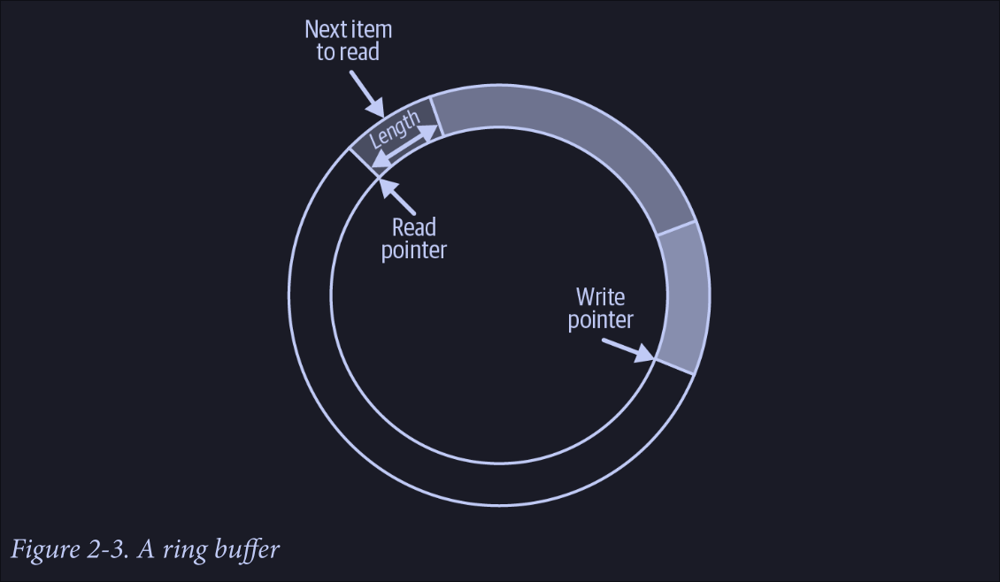
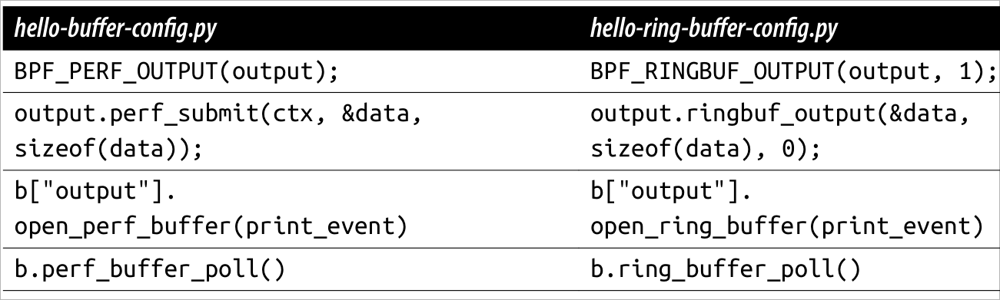

eBPF 是一项革命性的技术, 起源于Linux 内核, 它可以在特权上下文中(如操作系统内核)运行沙盒程序. 它用于安全有效地扩展内核的功能, 而无需通过更改内核源代码或加载内核模块的方式来实现. 从历史上看,由于内核具有监督和控制整个系统的特权,操作系统一直是实现可观测性, 安全性和网络功能的理想场所.

对ebpf慕名许久, 正好趁寒假拜读一下Learning eBPF, 虽然是基于略过时的框架bcc, 但是在这个过程中学到的知识想必依旧可以迁移到别的框架去.

## Background and pre-knowledge

### bcc

bcc的ebpf c代码不是真正的C, 而是bcc自己定义的一种和C类似的语言.

### limitation of ebpf program

- eBPF 程序必须被验证器校验通过后才能执行，且不能包含无法到达的指令；
- eBPF 程序不能随意调用内核函数，只能调用在 API 中定义的辅助函数；
- eBPF 程序栈空间最多只有 512 字节，想要更大的存储，就必须要借助映射存储；
- 在内核 5.2 之前，eBPF 字节码最多只支持 4096 条指令，而 5.2 内核把这个限制提高到了 100 万条；
- 由于内核的快速变化，在不同版本内核中运行时，需要访问内核数据结构的 eBPF 程序很可能需要调整源码，并重新编译。

### tracepoint and kprobe

tracepoint其实就是在Linux内核的一些关键函数中埋下的hook点,这样在tracing的时候,我们就可以在这些固定的点上挂载调试的函数,然后查看内核的信息.

Tracepoint是在内核中固定的hook点, 并不是在所有的函数中都有tracepoint. 这时候, 我们就需要用到kprobe了. kprobe可以动态地在所有的内核函数(除了inline函数)上挂载probe函数

### eBPF virtual machine

The ebpf virtual machine uses 10 general-purpose registers (0-9), and additional register 10 which was used as a stack frame pointer (can only be read but not written). As a BPF program is executed, **values get stored in these registers to keep track of state.**

eBPF uses a JIT compiler to convert eBPF bytecode to machine code that runs natively on the target CPU .

### BPF Program and Map references

Loading a BPF program into kernel returns a file descriptor, which is a reference to the program and is owned by userspace process. When that process exits, the file descriptor gets released. When there are no references left to BPF program, the kernel removes the program.

`bpftool` will **pin** the program to the filesystem, which creates additional descriptor and the program won't exit even if `bpftool` exits.

### libbpf & vmlinux

`vmlinux.h` is drived from the kernel source headers, which includes any kernel data structures or type, and is necessary for eBPF program so that you dont have to write definitions for types like u32, u64 by hand.

to use any BPF helper functions, it's needed to include header files from `libbpf`, which includes the definitions of helper functions and is also needed in **both user space and eBPF C code**.

## Basic Helloworld

### Hash Table Map

Hash Table Map is an highly useful data struction which could be accessed by ebpf program or userspace program.

```python
#!/usr/bin/python
from bcc import BPF
from time import sleep

program_hello_map = r"""
// define a hash table to store counter data.
BPF_HASH(counter_table);

int hello(void *ctx) {
    u64 uid;
    u64 counter = 0;
    u64 *p;

    // a ebpf helper function to obtain uid of current process
    uid = bpf_get_current_uid_gid() & 0xFFFFFFFF;
    // update hashtable
    p = counter_table.lookup(&uid);
    if (p != 0) {
        counter = *p;
    }
    counter ++;
    counter_table.update(&uid, &counter);
    return 0;
}
"""

b = BPF(text=program_hello_map)
# execve is only an interface in linux kernel, 
# the specific function names vary across different architectures,
# thus we should find the function name before attaching it.
syscall = b.get_syscall_fnname("execve")
# attach to execve syscall
b.attach_kprobe(event=syscall, fn_name=b"hello")

while True:
    sleep(2)
    s = ""
    # read from hash table
    for k,v in b["counter_table"].items():
        s += f"ID: {k.value} - {v.value}\t"
    print(s)
```

### ring buffer maps

Ring buffer consists of a buffer, a pointer for written, and pointer for read. The access of data depend on the movement of these two pointers. When a element was read out, the others didn't need to change its location. Data writing may overwrite data that has not been read in a timely manner, which is permissible in some scenarios.




The hello world example using ring buffer in book:

```python
from bcc import BPF

bpf_code = r"""
BPF_RINGBUF_OUTPUT(output,1);

struct data_t {
    int pid;
    int uid;
    char command[16];
    char message[12];
};

int hello(void *ctx) {
    struct data_t data = {};
    char message[] = "Hello, perf_event!";
    data.pid = bpf_get_current_pid_tgid() >> 32;
    data.uid = bpf_get_current_uid_gid() & 0xFFFFFFFF;

    bpf_get_current_comm(&data.command, sizeof(data.command));
    bpf_probe_read_kernel(&data.message, sizeof(data.message), message);
    // write data into ring buffer
    output.ringbuf_output(&data, sizeof(data), 0);
    return 0;
}
"""

b = BPF(text=bpf_code)
syscall = b.get_syscall_fnname("execve")
b.attach_kprobe(event=syscall, fn_name=b"hello")

def print_event(cpu, data, size):
    # generate the data structure from C declaration automatically
    # This conversion allows the Python program to access the fields (pid, uid, command, message) of the data_t structure as attributes of the data object in Python.
    data = b["output"].event(data)
    print(f"{data.pid} {data.uid} {data.command.decode()} {data.message.decode()}")

# callback function after reading data
b["output"].open_ring_buffer(print_event)
while True:
    # read from ring buffer, every execution will trigger callback function print_event
    b.ring_buffer_poll()
```

**Ring buffers are preferred over perf buffers for performance reasons, here is the difference in example code**




### tail calls

bpf_tail_call 是一个 eBPF 提供的机制, 它允许一个 eBPF 程序调用另一个 eBPF 程序, 类似于函数调用. 然而, 与传统的函数调用不同, bpf_tail_call 实际上是将当前程序替换为另一个程序, 而不是创建一个新的函数调用栈帧. 这意味着被调用的程序(尾调用程序)会接管当前程序的执行上下文, 并且当尾调用程序开始执行时, 原始程序的执行就结束了.

bpf的栈帧空间只有512字节. tail call的通用目的是为了避免当函数递归调用时,栈帧无限地增加(这会导致栈溢出)


```python
from bcc import BPF
import ctypes as ct

bpf_code = """
// define maps of type BPF_MAP_TYPE_PROG_ARRAY
BPF_PROG_ARRAY(syscall, 300);

int hello(struct bpf_raw_tracepoint_args *ctx) {
    // get opcode of syscall
    int opcode = ctx->args[1];
    // different tail call according to opcode
    // This line will be replaced with bpf_tail_call() helper function by bcc bofore compiling.
    syscall.call(ctx, opcode);
    // If there is no matched program, then continue execution.
    bpf_trace_printk("Another syscall: %d", opcode);
    return 0;
}

int hello_exec(void *ctx) {
    bpf_trace_printk("execve syscall");
    return 0;
}

int hello_timer(struct bpf_raw_tracepoint_args *ctx) {
    if (ctx->args[1] == 222) {
        bpf_trace_printk("Create a timer");
    } else if (ctx->args[1] == 226) {
        bpf_trace_printk("Delete a timer");
    } else {
        bpf_trace_printk("Aome other timer opration");
    }
    return 0;
}

int ignore_opcode(void *ctx) {
    return 0;
}
"""

b = BPF(text=bpf_code)

# This time, we attach ebpf program to tracepoint named sys_enter rather than a kprobe
b.attach_raw_tracepoint(tp=b"sys_enter", fn_name=b"hello")

# Get file descriptors of functions
ignore_fn = b.load_func("ignore_opcode", BPF.RAW_TRACEPOINT)
exec_fn = b.load_func("hello_exec", BPF.RAW_TRACEPOINT)
timer_fn = b.load_func("hello_timer", BPF.RAW_TRACEPOINT)

prog_array = b.get_table("syscall")

# put descriptors into map of syscalls
prog_array[ct.c_int(59)] = ct.c_int(exec_fn.fd)
prog_array[ct.c_int(222)] = ct.c_int(timer_fn.fd)
prog_array[ct.c_int(223)] = ct.c_int(timer_fn.fd)
prog_array[ct.c_int(224)] = ct.c_int(timer_fn.fd)
prog_array[ct.c_int(225)] = ct.c_int(timer_fn.fd)
prog_array[ct.c_int(226)] = ct.c_int(timer_fn.fd)

# Ignore some syscalls that come up a lot
prog_array[ct.c_int(21)] = ct.c_int(ignore_fn.fd)
# ......
prog_array[ct.c_int(291)] = ct.c_int(ignore_fn.fd)

b.trace_print()
```

## Simple XDP program in C

Bcc provide a convenient way to write and run ebpf program, however, it would be better to dive deeply in order to have better understand. So, here is a XDP program written in C.

```c
#include <linux/bpf.h>
#include <bpf/bpf_helpers.h>

int counter = 0;

// define that this is an eXpress Data Path (XDP) program
SEC("xdp")
int hello(void *ctx) {
	counter++;
    // same as bpf_trace_printk() in bcc, both of them are wrappers around kernel function `bpf_trace_printk` 
	bpf_printk("Helloworld %d", counter);
	return XDP_PASS;
}

// define license for this program
char _license[] SEC("license") = "GPL";
```

This program do nothing but print variable `count` everytime the XDP event been triggered, which means a network packet arrives inbound on a network interface.

After writting, we need to compile and load it.

```sh
# compile, here we got the bytecode of the program
clang -O2 -target bpf -c hello.bpf.c -o hello.bpf.o
# load program into kernel, here the bytecode will be transformed to machine code.
bpftool prog load hello.bpf.o /sys/fs/bpf/hello
# inspect the loaded program
bpftool prog list
bpftool prog show id 95 --pretty
bpftool prog show name hello
# attach to XDP event on a network interface
bpftool net attach xdp id 95 dev enp0s31f6
# check the program
bpftool net list
# check the output
cat /sys/kernel/debug/tracing/trace_pipe
# check the global variable counter
bpftool map dump name hello.bss
# detach the program
bpftool net detach xdp dev enp0s31f6
```

## bpftool usage

```sh
# load program into kernel
bpftool prog load hello.bpf.o /sys/fs/bpf/hello
# inspect the loaded program
bpftool prog list
bpftool prog show id 95 --pretty
bpftool prog show name hello
# attach to XDP event on a network interface
bpftool net attach xdp id 95 dev enp0s31f6
# check the program
bpftool net list
# check the global variable counter
bpftool map dump name hello.bss
# detach the program
bpftool net detach xdp dev enp0s31f6

# list btf (bpf type format)
bpftool btf list
# inspect  the contents of BTF information
bpftool btf dump id 251
# generate header file from BTF information
bpftool btf dump file /sys/kernel/btf/vmlinux format c > vmlinux.h
```

## CO-RE (Compile Once, Run Everywhere) eBPF Programs

```c
#include "vmlinux.h"
#include <bpf/bpf_helpers.h>
#include <bpf/bpf_tracing.h>
#include <bpf/bpf_core_read.h>

char message[12] = "Hello World";

struct {
    __uint(type, BPF_MAP_TYPE_PERF_EVENT_ARRAY);
    __uint(key_size, sizeof(u32));
    __uint(value_size, sizeof(u32));
} output SEC(".maps");

struct data_t {
   int pid;
   int uid;
   char command[16];
   char message[12];
   char path[16];
};

struct user_msg_t {
    char message[12];
};

// This structure is used to define the map, not map itself
// however, my_config can be the map's reference
struct {
    __uint(type, BPF_MAP_TYPE_HASH);
    __uint(max_entries, 10240);
    __type(key, u32);
    __type(value, struct user_msg_t);
} my_config SEC(".maps");

// Tells the loader to attach to the program to the kprobe in the execve syscall
// BPF_KPROBE_SYSCALL is a macro that expands to the correct BPF program type
// The first argument is the name of the program: hello
// The second argument is the executable pathname for execve syscall
SEC("ksyscall/execve")
int BPF_KPROBE_SYSCALL(hello, const char *pathname) {
    struct data_t data = {};
    struct user_msg_t *p;

    data.pid = bpf_get_current_pid_tgid() >> 32;
    data.uid = bpf_get_current_uid_gid() & 0xFFFFFFFF;

    bpf_get_current_comm(&data.command, sizeof(data.command));
    bpf_probe_read_user_str(&data.path, sizeof(data.path), pathname);

    // my_config is the map's reference
    p = bpf_map_lookup_elem(&my_config, &data.uid);
    if (p != 0) {
        bpf_probe_read_kernel_str(&data.message, sizeof(data.message),
                                  p->message);
    } else {
        bpf_probe_read_kernel_str(&data.message, sizeof(data.message), message);
    }

	// submit the data to the user space
    bpf_perf_event_output(ctx, &output, BPF_F_CURRENT_CPU, &data, sizeof(data));
    return 0;
}

char LICENSE[] SEC("license") = "Dual BSD/GPL";
```

The `Makefile`

```
TARGET = hello-buffer-config
ARCH = $(shell uname -m | sed 's/x86_64/x86/' | sed 's/aarch64/arm64/')

BPF_OBJ = ${TARGET:=.bpf.o}
USER_C = ${TARGET:=.c}
USER_SKEL = ${TARGET:=.skel.h}

all: $(TARGET) $(BPF_OBJ) find-map
.PHONY: all 

$(TARGET): $(USER_C) $(USER_SKEL) 
	gcc -Wall -o $(TARGET) $(USER_C) -L../libbpf/src -l:libbpf.a -lelf -lz

%.bpf.o: %.bpf.c vmlinux.h
	clang \
	    -target bpf \
        -D __TARGET_ARCH_$(ARCH) \
	    -Wall \
	    -O2 -g -o $@ -c $<

$(USER_SKEL): $(BPF_OBJ)
	bpftool gen skeleton $< > $@

vmlinux.h:
	bpftool btf dump file /sys/kernel/btf/vmlinux format c > vmlinux.h

clean:
	- rm $(BPF_OBJ)
	- rm $(TARGET)
	- rm find-map

find-map: find-map.c
	gcc -Wall -o find-map find-map.c -L../libbpf/src -l:libbpf.a -lelf -lz
```

load:
```sh
bpftool prog load hello.bpf.o /sys/fs/bpf/hello
```

## eBPF for Networking

### Packet Drops

An example based on bcc, which drops all received ICMP requests, run it with root privilege. NOTE: the `network.h` will failed to parse packets at newer kernel.

```python
#!/usr/bin/python3
from bcc import BPF
import socket
import os
from time import sleep
import sys

b = BPF(src_file="ping.bpf.c")
interface = "lo"

# XDP will be the first program hit when a packet is received ingress
fx = b.load_func("xdp", BPF.XDP)
BPF.attach_xdp(interface, fx, 0)

try:
    b.trace_print()
except KeyboardInterrupt:
    sys.exit(0)
```

```c
#include "network.h"
#include <bcc/proto.h>
#include <linux/pkt_cls.h>

int xdp(struct xdp_md *ctx) {
  void *data = (void *)(long)ctx->data;
  void *data_end = (void *)(long)ctx->data_end;

  if (is_icmp_ping_request(data, data_end)) {
        bpf_trace_printk("Got ping packet");
        return XDP_DROP;
  }

  return XDP_PASS;
}
```


XDP Offloading: run eBPF programs on a network card to make decisions about individual packets before they even reach the kernel’s networking stack

### Load Balancing and Forwarding

omit

### Traffic Control

eBPF programs attached within the TC subsystem receive a pointer to the sk_buff structure as the context parameter, which happens after XDP hook, and so XDP programs dont use the same structure for their context.

> The TC subsystem is intended to regulate how network traffic is scheduled.

omit  


### Packet Encryption and Decryption

[example](https://github.com/pixie-io/pixie-demos/tree/410447afd6e566050e8bbf4060c66d76660cb30b/openssl-tracer)

### eBPF and Kubernetes Networking

- avoid iptables to improve performance
- network policy enforcement
- encrypted connections (offload the encryption requirement from application, either to a service mesh layer or to the underlying network itself)

## eBPF for Security

### Using System Calls for Security Events

- use seccomp-bpf to filter the syscalls that are and aren't allowed
- record the set of syscalls an application makes, and generate a seccomp profile to restrict container activities.
- syscall traching : Falco

### BPF LSM

The LSM interface provides a set of hooks that each occur just before the kernel is about to act on a kernel data structure. The function called by a hook can make a decision about whether to allow the action to go ahead.
