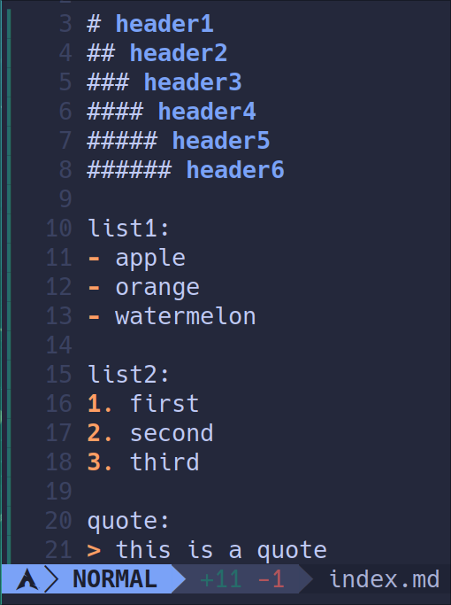

> eye candy也是一种生产力!

<!--more-->

## 动机

treesitter为neovim带来了语法高亮, 让不同语言都被解析成统一的语法树, 并对语法树上的不同部分进行样式的定义. 然而, neovim treesitter对markdown的默认解析方式和高亮模式过于简陋, 不同层级的标题采用的是统一的样式, 列表也仅有开头采用了高亮. 这对于日常使用neovim来编辑markdown的人十分不友好, 于是我花了一点时间了解了一下treesitter的高亮过程, 并最终形成了自定制的漂亮样式.

这是原来的



这是自定义后的


## 步骤

1. 复制neovim treesitter插件自带的markdown `highlight.scm` 文件, 由于我使用的插件管理器是lazy, 因此该文件位于`~/.local/share/nvim/lazy/nvim-treesitter/queries/markdown/highlights.scm `

2. 进入你的配置文件目录 `~/.config/nvim`, 创建 `~/.config/nvim/queries/markdown/highlights.scm` , 没有目录就创建一下, 将第一步复制的文件内容复制到这里来

3. 对`~/.config/nvim/queries/markdown/highlights.scm` 进行自定义修改, 在这里贴出我的

    ```
    ;From MDeiml/tree-sitter-markdown
    ; (atx_heading (inline) @text.title)
    ; (setext_heading (paragraph) @text.title)
    
    ; [
    ;   (atx_h1_marker)
    ;   (atx_h2_marker)
    ;   (atx_h3_marker)
    ;   (atx_h4_marker)
    ;   (atx_h5_marker)
    ;   (atx_h6_marker)
    ;   (setext_h1_underline)
    ;   (setext_h2_underline)
    ; ] @punctuation.special
    
    [
      (atx_heading
        (atx_h1_marker))
    ] @text.title1
    
    [
      (atx_heading
        (atx_h2_marker))
    ] @text.title2
    
    [
      (atx_heading
        (atx_h3_marker))
    ] @text.title3
    
    [
      (atx_heading
        (atx_h4_marker))
    ] @text.title4
    
    [
      (atx_heading
        (atx_h5_marker))
    ] @text.title5
    
    [
      (atx_heading
        (atx_h6_marker))
    ] @text.title6
    
    [
      (link_title)
      (indented_code_block)
      (fenced_code_block)
    ] @text.literal
    
    (pipe_table_header (pipe_table_cell) @text.title)
    
    (pipe_table_header "|" @punctuation.special)
    (pipe_table_row "|" @punctuation.special)
    (pipe_table_delimiter_row "|" @punctuation.special)
    (pipe_table_delimiter_cell) @punctuation.special
    
    [
      (fenced_code_block_delimiter)
    ] @punctuation.delimiter
    
    (code_fence_content) @none
    
    [
      (link_destination)
    ] @text.uri
    
    [
      (link_label)
    ] @text.reference
    
    [
      (thematic_break)
      (list
        (list_item
          (list_marker_minus)
          (paragraph
            (inline))))
      (list
        (list_item
          (list_marker_plus)
          (paragraph
            (inline))))
      (list
        (list_item
          (list_marker_star)
          (paragraph
            (inline))))
      (list
        (list_item
          (list_marker_dot)
          (paragraph
            (inline))))
      (list
        (list_item
          (list_marker_parenthesis)
          (paragraph
            (inline))))
    ] @punctuation.special2
    
    
    
    (task_list_marker_unchecked) @text.todo.unchecked
    (task_list_marker_checked) @text.todo.checked
    
    (block_quote) @text.quote
    
    [
      (block_continuation)
      (block_quote_marker)
    ] @punctuation.special
    
    [
      (backslash_escape)
    ] @string.escape
    
    ([
      (info_string)
      (fenced_code_block_delimiter)
    ] @conceal
    (#set! conceal ""))
    
    (inline) @spell
    ```

4. 前往`~/.config/nvim/ftplugin/markdown.lua`文件, 为新增加的节点定义高亮样式, 我的该文件内容如下, 读者可以自行修改颜色

    ```lua
    vim.opt_local.expandtab = true
    vim.opt_local.shiftwidth = 4
    vim.opt_local.tabstop = 4
    vim.opt_local.softtabstop = 4
    vim.opt_local.foldmethod = "expr"
    vim.opt_local.foldexpr = "nvim_treesitter#foldexpr()"
    
    vim.api.nvim_set_hl(0, "@text.title1", {fg="#7aa2f7", bold=true, italic=true})
    vim.api.nvim_set_hl(0, "@text.title2", {fg="#ff9e64", bold=true, italic=true})
    vim.api.nvim_set_hl(0, "@text.title3", {fg="#9ece6a", bold=true, italic=true})
    vim.api.nvim_set_hl(0, "@text.title4", {fg="#7dcfff", bold=true, italic=true})
    vim.api.nvim_set_hl(0, "@text.title5", {fg="#bb9af7", bold=true, italic=true})
    vim.api.nvim_set_hl(0, "@text.title6", {fg="#cfc9c2", bold=true, italic=true})
    vim.api.nvim_set_hl(0, "@text.quote", {fg="#bb9af7", bold=false, italic=true})
    vim.api.nvim_set_hl(0, "@punctuation.special2", {fg="#73daca", bold=true, italic=false})
    ```

End
